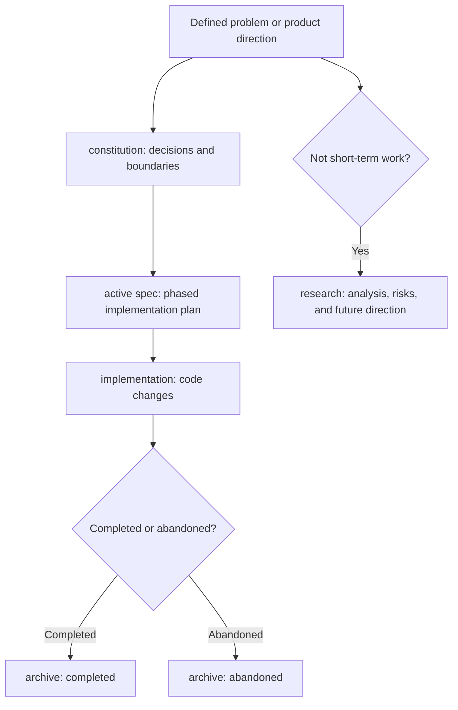

Poco favors spec-driven development. This follows the harness engineering principle: keep as much project context as possible inside the repository instead of leaving it in chat history, temporary notes, or personal memory.

Large feature work should leave more than a code diff. Design decisions, rejected approaches, implementation plans, progress updates, unresolved questions, and future research directions should live in `specs/` whenever possible, so future developers and agents can audit the full chain.

## Why specs matter

When agents participate in development, the main risk is unstable context. A decision made in one conversation is hard to recover in a later session unless it becomes part of the repository.

Spec-driven development turns that context into repository state.

- **Auditable**: You can trace why a feature was designed this way, which alternatives were rejected, and where implementation currently stands.
- **Recoverable**: Agents can read `specs/active` to recover current work context without depending on the previous chat.
- **Collaborative**: Product, engineering, and agents can align on the same constitution or spec.
- **Evolvable**: Work that is not ready for implementation goes into research instead of being forgotten or mixed into current plans.

## Documentation flow

For a defined problem, start with a constitution, derive one or more active specs from it, implement from those specs, and archive the result.

This keeps "why," "how," and "current progress" separate. Constitution records long-lived decisions, active specs guide implementation, and research captures exploration that has not become a decision.

## Directory roles

The `specs/` folders represent development state, not only document categories.

| Directory       | Role                                                                                                     | Use it when                                                         |
| --------------- | -------------------------------------------------------------------------------------------------------- | ------------------------------------------------------------------- |
| `constitution/` | Records decided design choices, experience goals, and structural boundaries.                             | The direction is settled and should become a long-lived constraint. |
| `active/`       | Records current implementation plans with background, design, and phases.                                | The work is ready to implement.                                     |
| `research/`     | Records problem analysis, technical evaluation, performance investigation, and architecture exploration. | The work is not ready or does not need short-term implementation.   |
| `archive/`      | Stores completed or abandoned specs.                                                                     | Implementation is finished, or the approach has been dropped.       |

Large feature work should default to reading current context from `active/`. A new agent should read the related constitution first, then the active spec, instead of reconstructing design intent from code alone.

## What to write

If the problem and direction are clear, write a constitution first. It answers "what did we decide?" and records the invariants future implementation should not quietly violate.

If the work can be implemented, write an active spec. It answers "how will we do it?" and breaks execution into verifiable phases.

If the problem cannot be solved soon, or does not need short-term execution, write research. It answers "what did we discover, and what still needs investigation?" without turning future direction into a current commitment.

## Suggested workflow for large features

Use this flow for changes that affect multiple modules, services, or product boundaries.

1. Describe the problem: current state, limitation, and consequence of doing nothing.
2. If the direction is settled, record it in `specs/constitution/`.
3. Derive one or more `specs/active/*-plan.md` files with phases, verification points, and scope.
4. During implementation, keep the active spec updated with completed work, plan changes, and new risks.
5. If you find work that is not ready to implement, move it into `specs/research/`.
6. When the work is completed or abandoned, move the spec into `specs/archive/`.

This process is not required for every small change. It is intended for feature work that crosses modules, changes service boundaries, or alters product behavior.

## Writing principles

Specs should help future implementation, not add ceremony.

- Constitution starts with the final decision, then adds necessary background and alternatives.
- Active specs explain background, design, and phased implementation, not only task lists.
- Research documents the problem, method, findings, option evaluation, and next steps.
- Documents should preserve invariants, API boundaries, data flow, and failure handling.
- Do not silently delete outdated context. Use history, archive, or superseded status to preserve how the work evolved.

The goal is that future developers and agents can recover context from the repository: why the design exists, what plan to follow now, and which ideas are still only research.
