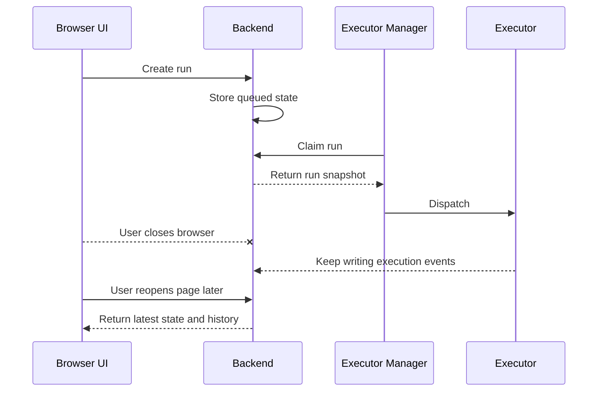
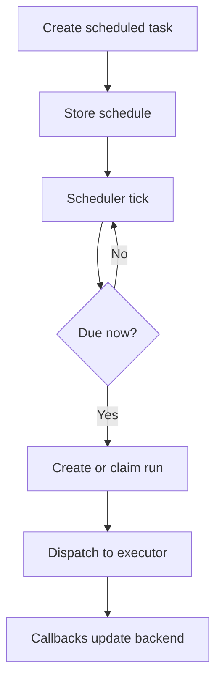

Poco supports long-running tasks beyond an active browser tab. This powers not only standalone task execution, but also persistent agents inside server and channel collaboration.

## Background execution flow

After a task is created, Backend stores the run. Executor Manager claims and dispatches it, and Executor keeps running in the sandbox. Closing the browser only disconnects the current UI session; it doesn't delete an already scheduled run.

## Scheduled and delayed execution

Executor Manager can treat tasks as schedulable objects. A task can wait until a specific time or run when the scheduler rule becomes due.

## Highlights

Background execution matters most when work needs to keep moving without an active browser tab.

- Tasks can keep running after the browser is closed
- Scheduled jobs support recurring or delayed execution
- Cloud-side execution fits longer or asynchronous workflows

## How this appears in server collaboration

When you `@agent` inside a channel, Poco can resume that agent's persistent runtime and keep the work moving in the background. The channel shows a compact execution placeholder first, while deeper thinking, tool calls, and runtime details stay inside the execution drawer. You can keep following progress without pinning the browser tab in the foreground.
