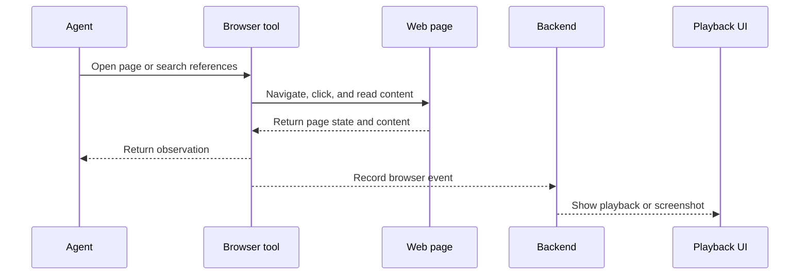

Poco includes a browser capability for autonomous web interaction.

## Browser event flow

When a Preset or task enables browser capability, Executor exposes browser tools to the run. Navigation, clicks, screenshots, and page reads become execution events that users can review later.

## Typical usage

- Online research
- Gathering references across sites
- Synthesizing information before execution or reporting
