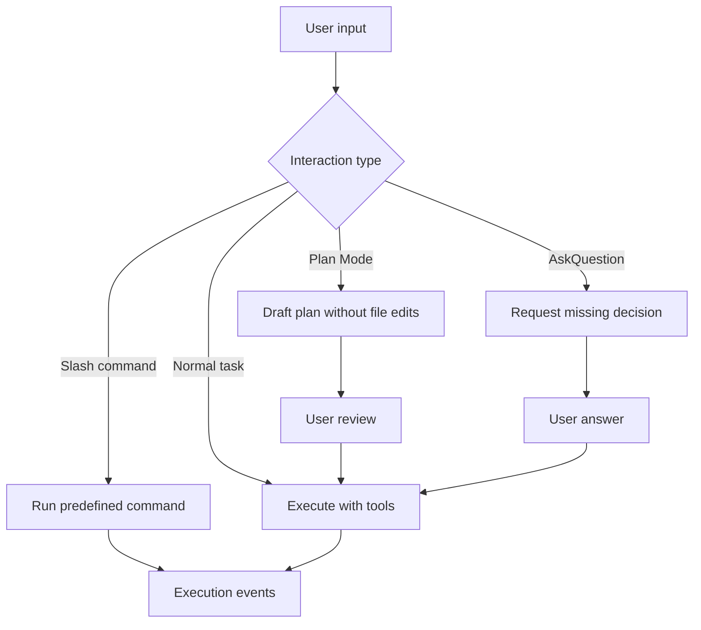

Poco aims to reproduce the native interaction model people expect from Claude Code.

## Interaction flow

The core pattern is to clarify intent before using tools. Slash commands trigger structured actions, Plan Mode drafts work before execution, and AskQuestion collects missing decisions.

## Included patterns

- Slash Commands
- Plan Mode
- AskQuestion

This lowers the learning curve for users who already work in agentic coding workflows.
