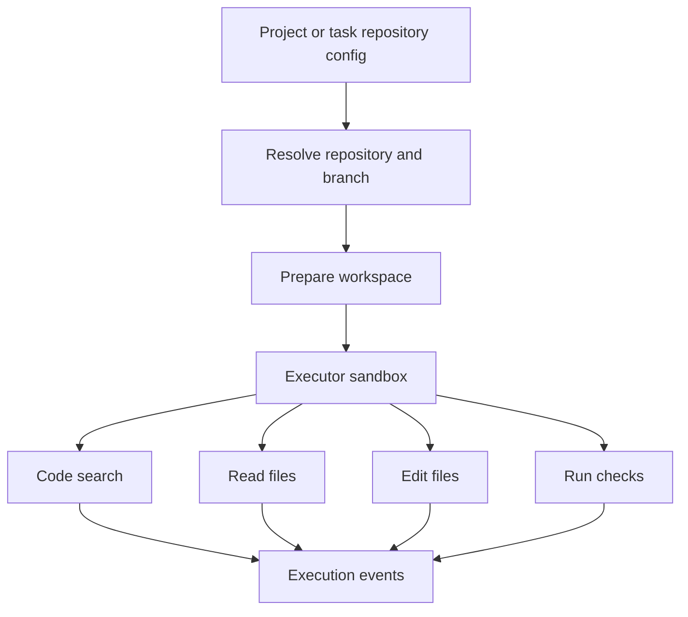

Poco can connect to GitHub repositories as part of the execution workflow.

## Repository execution flow

Repository configuration can come from project defaults, the task editor, or Preset-linked capability settings. At runtime, Poco turns that repository context into workspace files and tool access for the agent.

## Supported value

- Repository-aware code search
- In-product code reading
- Editing flows linked to actual project context
