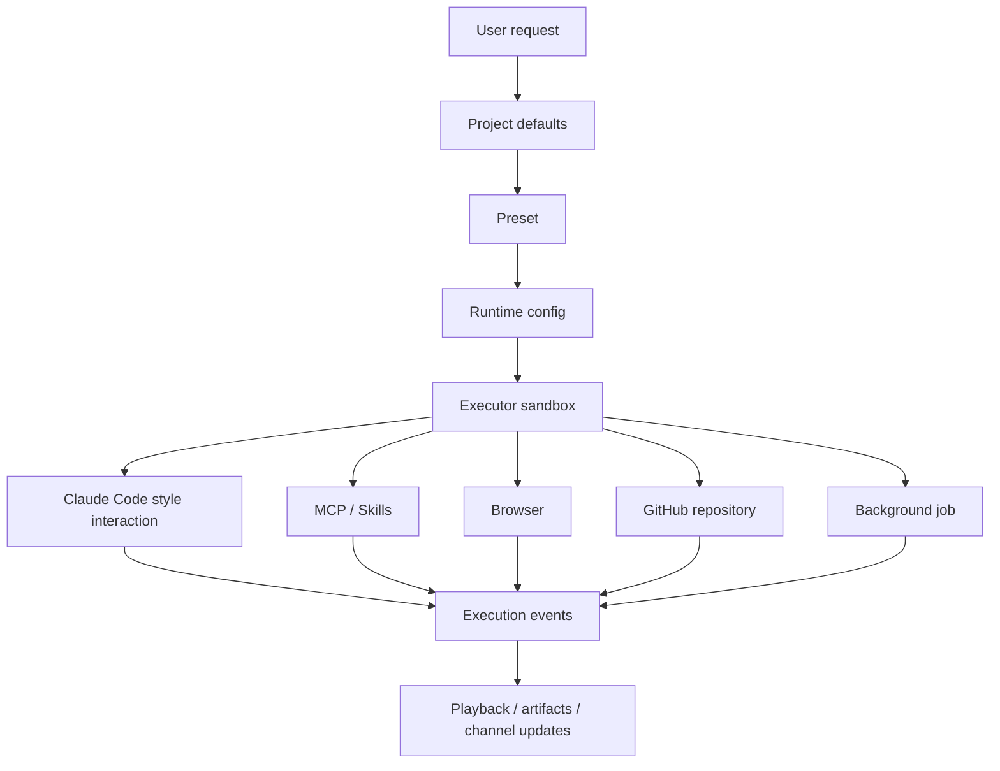

Poco is designed to feel like a fully capable agent runtime instead of a thin wrapper around a model.

## Workflow overview

An agent run inherits project defaults and Preset configuration before it enters sandbox execution. During execution, the agent can use MCP, Skills, browser, and GitHub tools. Runtime events flow back to the execution drawer and playback view.

## Capabilities

- [Claude Code–style native workflow](./claude-code)
- [Preset runtime config](./preset)
- [MCP and custom Skills](./mcp-skills)
- [Built-in browser](./browser)
- [GitHub repository connection](./github)
- [Background execution and scheduled jobs](./background-jobs)
