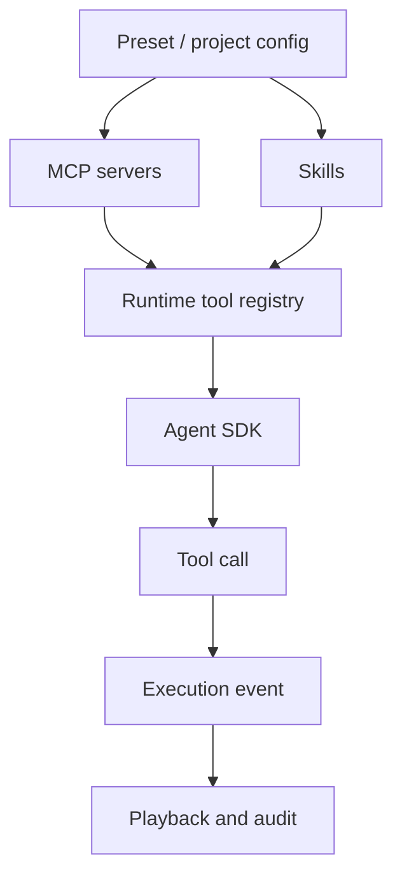

Poco supports the MCP protocol and custom Skills.

## Runtime loading flow

MCP servers and Skills usually enter runtime through a Preset or project config. When a task starts, Executor loads these capabilities in the sandbox and records calls as execution events.

## Why it matters

- Skills can be imported and reused easily
- The platform remains open-ended and extensible
- Teams can package domain knowledge into repeatable capabilities
