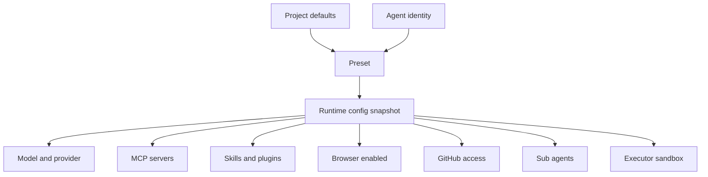
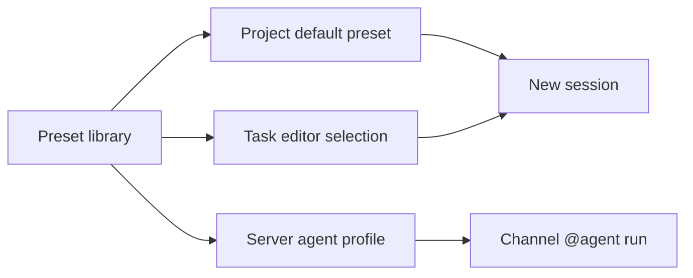

Presets are reusable agent runtime configurations. They let you define different agent behaviors for different scenarios and apply them quickly across projects and sessions.

## Runtime config snapshot

A Preset is not an agent identity and it is not a run. Identity represents long-lived collaboration membership, Preset represents capability configuration, and a run represents one execution.

## Configurable options

- **Model** — set the default model and provider
- **Capability toggles** — enable or disable browser, memory, and other capabilities
- **Tools** — configure MCP Servers, Skills, and Plugins
- **Sub-agents** — specify the set of callable sub-agents
- **Icon and description** — assign a visual identity for quick identification

## How to use

- Select a Preset in the task composer to run the session with that configuration
- Bind a default Preset to a project so new sessions inherit it automatically
- Override any Preset setting on a per-session basis

## Management

- CRUD management on the **Presets** page in the sidebar
- Quick-switch via the Preset picker in the task composer
