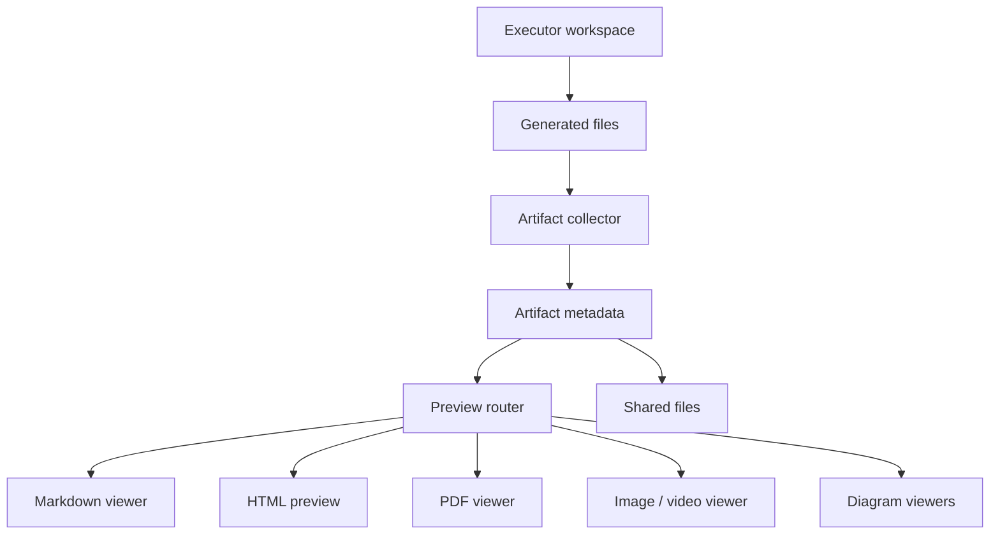

Poco provides a dedicated interface for rendered outputs.

## Artifact pipeline

After an agent generates files in the sandbox, Poco registers shareable outputs as artifacts. Users can preview them in the artifact view or reuse them as shared files in server collaboration.

## Supported output examples

- HTML
- PDF
- Markdown
- Images and video
- Xmind, Excalidraw, and Drawio artifacts

This makes generated results easier to consume without leaving the product.
