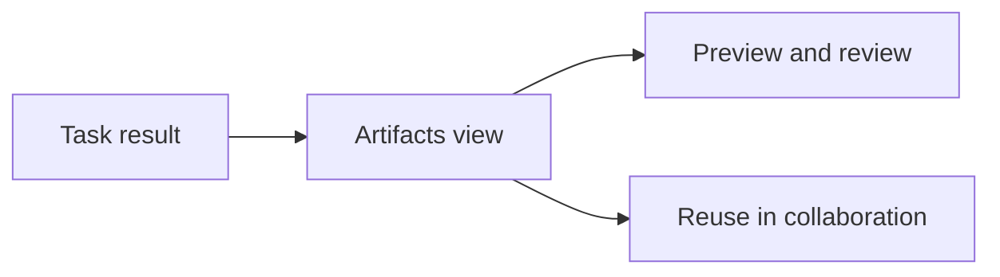

Poco provides a dedicated artifacts view for task results. It is more than an attachment list. It is where a generated result starts to become something the rest of the team can keep using.

## What the artifacts view does

Many agent tasks end with something richer than a text reply. The artifacts view exists so those results can be reviewed, reused, and carried forward.

Users do two things here: decide whether the result is good enough, and decide whether it should live on in later collaboration.

## Supported content types

- HTML
- PDF
- Markdown
- Images and video
- Xmind, Excalidraw, Drawio, and other diagram outputs

## Why this needs a dedicated interface

For many workflows, the real result is not a sentence. It is a document, a page, an image, or a diagram. A dedicated artifacts view keeps those outputs usable inside the product instead of sending users elsewhere just to inspect them.

More importantly, it gives an execution result a chance to stick around. Users can review quality, layout, and readability first; if the result is worth keeping, the team can continue from it instead of starting over.

## Relationship to shared files

When a result is worth reusing in the channel, it stops being only a one-time execution output and becomes part of the shared files layer. Later discussion, task progress, and follow-up agent work can all continue from the same material.
