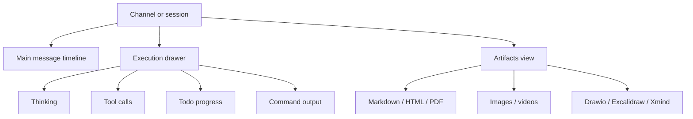

Poco focuses on both productivity and readability.

## Interface layers

Poco separates collaboration messages, execution details, and final outputs. The main timeline stays readable, the execution drawer carries runtime details, and the artifact viewer renders results.

## Included views

- [Artifacts view](./artifacts)
- [Playback view](./playback)
- [Theme support](./theme)
