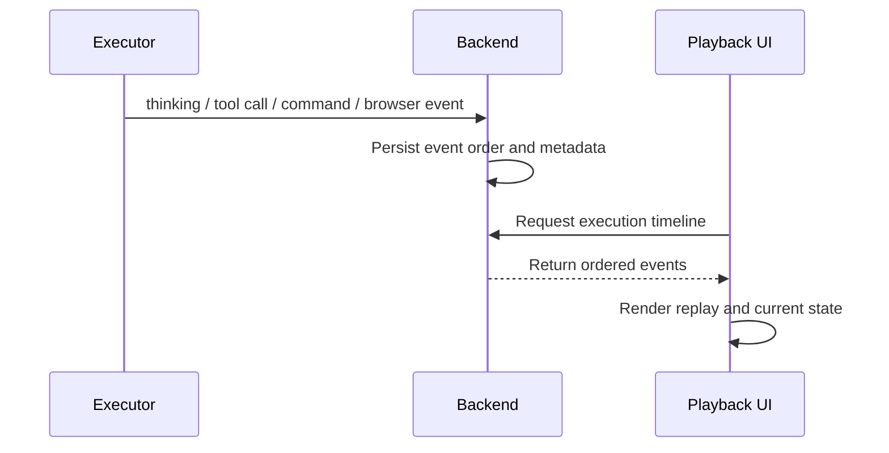
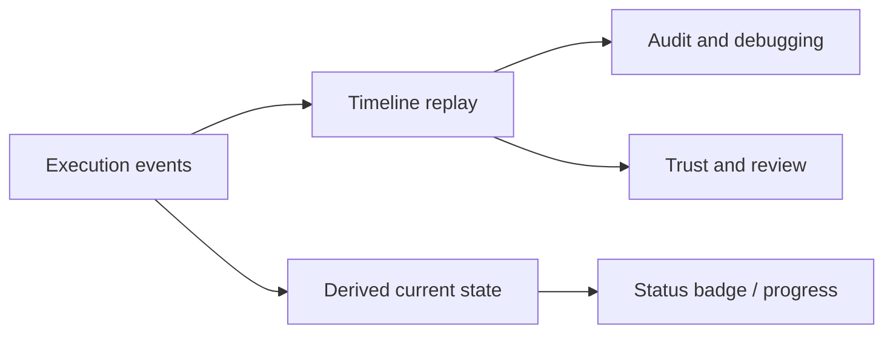

The playback interface helps you understand what the agent actually did.

## Event collection flow

Executor emits structured events while the agent works. Backend persists these events, and the UI renders them as a replayable timeline.

## From events to trust

Playback turns low-level runtime records into user-facing evidence.

## What you can review

- Command input and output
- Browser actions
- Skills and MCP invocation records

This is useful for debugging, trust building, and auditing agent behavior.
