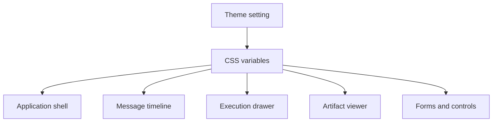

Poco supports both light mode and dark mode.

## Theme propagation

Theme settings drive CSS variables that apply across the shell, message timeline, execution drawer, artifact viewer, and form controls.

## Why it matters

- Better readability in different lighting conditions
- More comfortable long-session usage
- A more polished product experience across desktop and mobile
