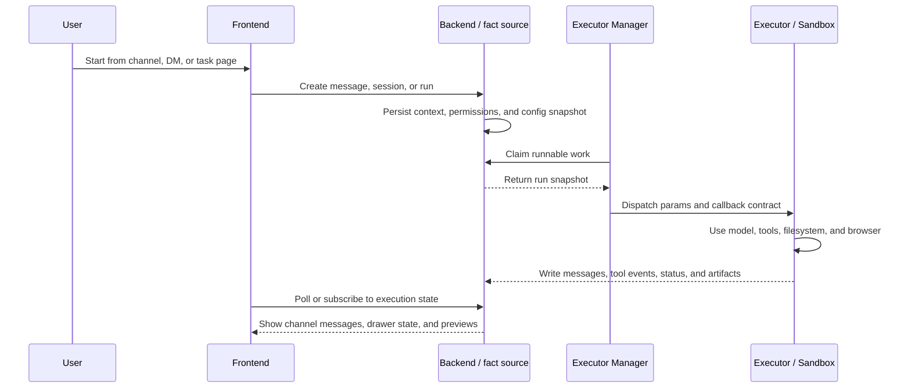
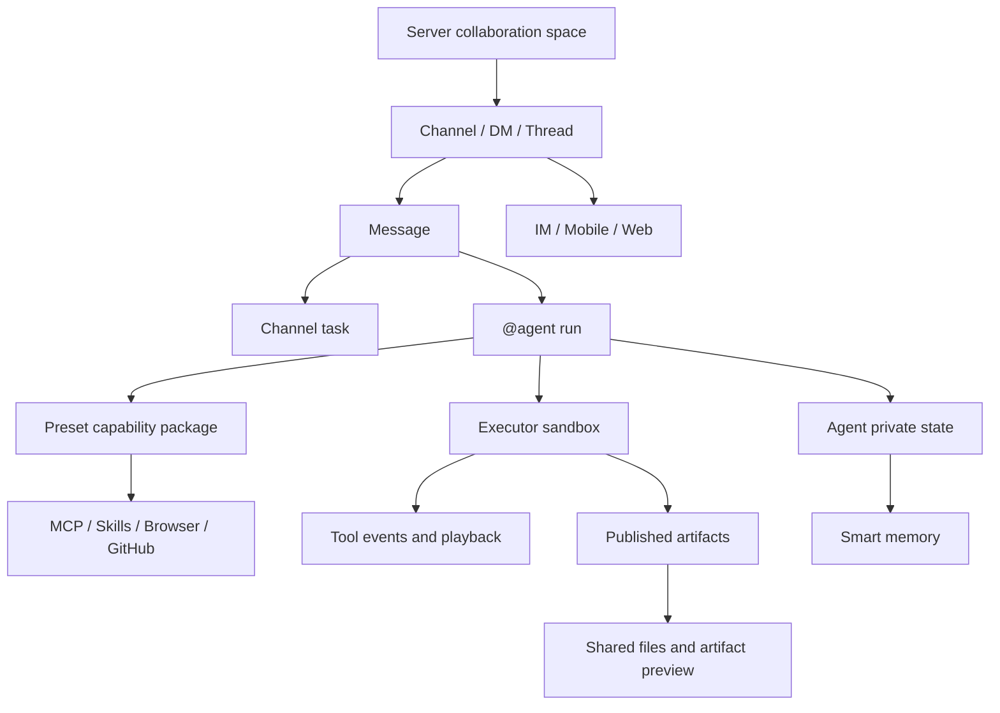
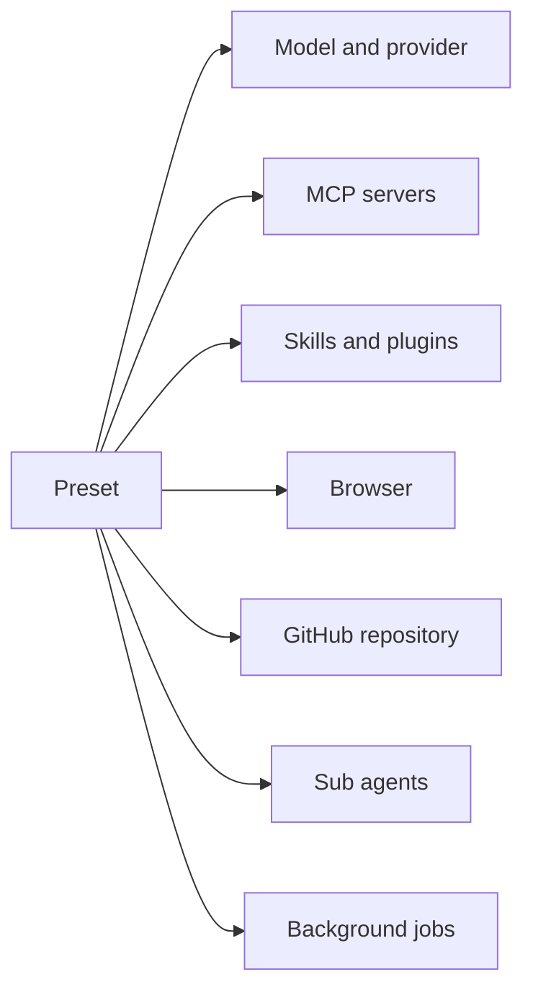

Poco is built to be more than a chat interface. It combines team collaboration, secure execution, agentic workflows, rich UI, cross-channel interaction, and persistent memory into one developer product.

## How a task moves through Poco

You can think of Poco as a collaboration source of truth plus a sandboxed execution plane. People start work from a server, channel, DM, or task page. The Backend stores collaboration facts and runtime state, Executor Manager schedules runnable work, and Executor runs the agent in an isolated sandbox before writing progress, tool events, and artifacts back.

## Capability layers

Poco capabilities are layered around one agent workflow. Collaboration lives at the top, reusable agent capabilities and context governance sit in the middle, and secure execution, mounts, memory, and multi-end messaging form the runtime foundation.

The diagram highlights three important boundaries.

- **Collaboration boundary**: servers, channels, DMs, threads, and tasks organize the shared human-agent context.
- **Execution boundary**: an agent run enters the sandbox before it can use shell, browser, MCP, Skills, and repository tools.
- **State boundary**: published artifacts become shared files, while agent-private state and long-term memory don't automatically become channel files.

## Agentic runtime package

Presets define reusable execution capabilities. They bundle the model, provider, tools, browser access, GitHub context, sub-agents, and background behavior that a run can use.

## Feature map

These sections map the current product around collaboration flow and core runtime capabilities.

- [Server collaboration and channel workflows](./server-collaboration)
- [Secure Sandbox](./secure-sandbox)
- [Not Just a ChatBot](./not-just-chatbot)
- [Beautiful and Efficient Interface](./beautiful-interface)
- [Agentic Experience](./agentic-experience)
- [Interaction Rebuild: Multi-end and Messaging](./multi-end-messaging)
- [Smart Memory](./smart-memory)
