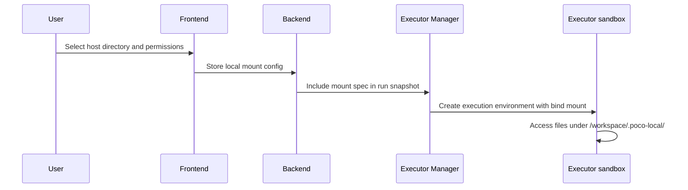
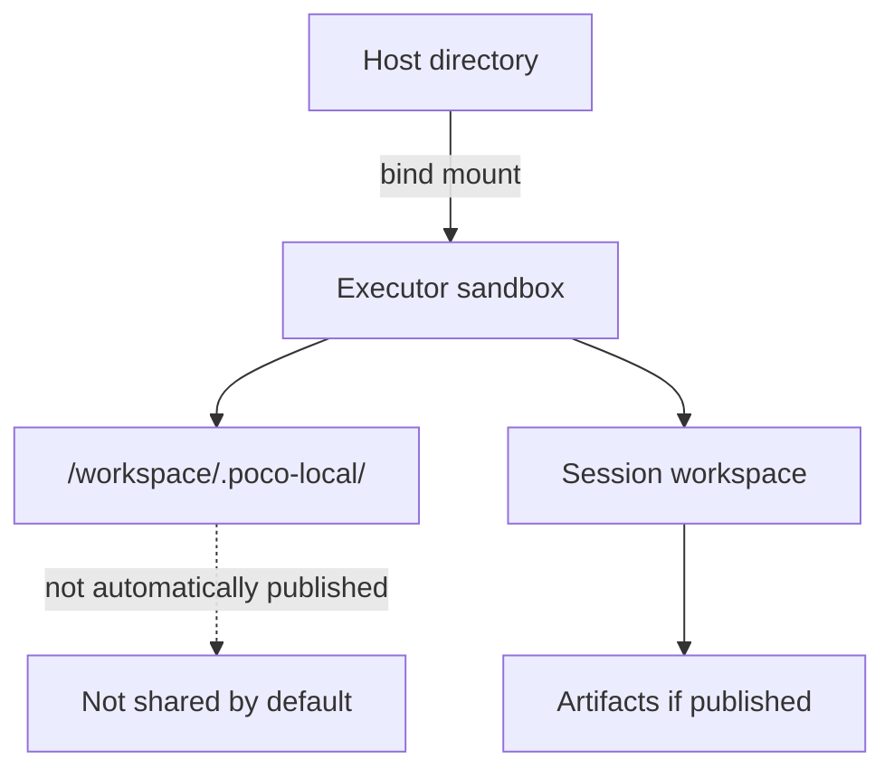

Mount local directories from your host machine into the executor sandbox, allowing the agent to read from and write to your real files.

## Mount flow

The user selects a local directory in the task composer or chat panel. Backend stores the mount config, Executor Manager converts it into a container bind mount, and Executor accesses it under `/workspace/.poco-local/`.

## When to use

- When you want the agent to work directly with your project files instead of sandbox copies
- When you need the agent to access local resources (data files, config directories, etc.)
- When you want changes to be persisted on your host machine after the task finishes

## How it works

1. Open the **Local Filesystem** dialog in the task composer or chat panel
2. Switch the mode from **Sandbox** to **Local Mount**
3. Add one or more directory entries with:
   - **Name**: a human-readable label for the mount
   - **Path**: the absolute path on your host machine (e.g. `/home/user/my-project`)
   - **Access**: read-only (`ro`) or read-write (`rw`)
4. Submit the task — the agent will see these directories under `/workspace/.poco-local/` inside the container

## Architecture

Local mounts are not shared files or agent private state. They are an explicit host permission boundary for the current run.

- Mounted directories appear under `/workspace/.poco-local/<mount-id>/` inside the container
- Changes in `rw` mounts are written directly to your host filesystem
- Mount contents are excluded from the sandbox git history and workspace snapshots

## Availability

Local directory mounting is controlled by the `DEPLOYMENT_MODE` environment variable:

| Value   | Behavior                       |
| ------- | ------------------------------ |
| `local` | Mounting is enabled (default)  |
| `cloud` | Mounting is disabled in the UI |

Set `DEPLOYMENT_MODE=cloud` in your backend configuration to disable this feature for cloud deployments. The interactive setup script (`scripts/quickstart.sh`) will prompt for this setting automatically.

## Limitations

- Only available in self-hosted deployments (requires direct bind-mount access to the host filesystem)
- Not available when deploying to cloud environments
- Read-only mounts cannot be written to by the agent
