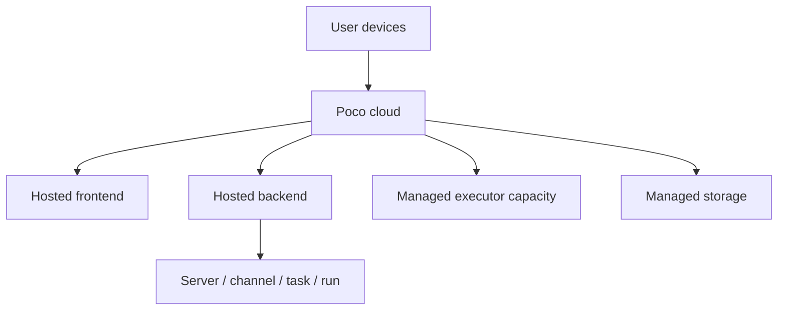

A managed cloud subscription offering is planned for the future.

## Hosted shape

A cloud subscription would host the core services and let users enter from Web, mobile, or IM. Compared with self-hosting, cloud usage emphasizes lower operations overhead and standardized runtime capacity.

## Direction

- Reduce self-hosting burden
- Offer a simpler onboarding path
- Bring managed access to Poco capabilities
