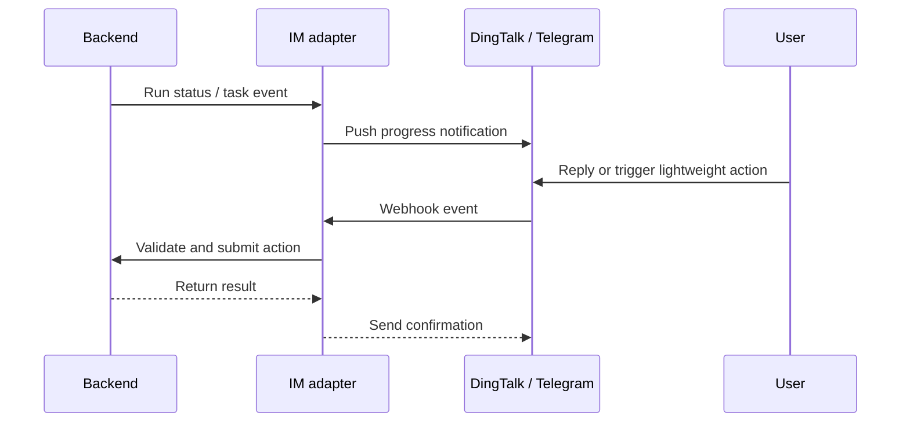

Poco supports messaging-driven interaction through DingTalk and Telegram.

## IM event flow

The IM adapter subscribes to backend events and pushes important state changes to external chat tools. Lightweight actions from IM are validated through Backend before they affect the unified state model.

## What it enables

- Push notifications for task progress
- Event subscriptions through chat tools
- Lightweight remote interaction without opening the main web UI
