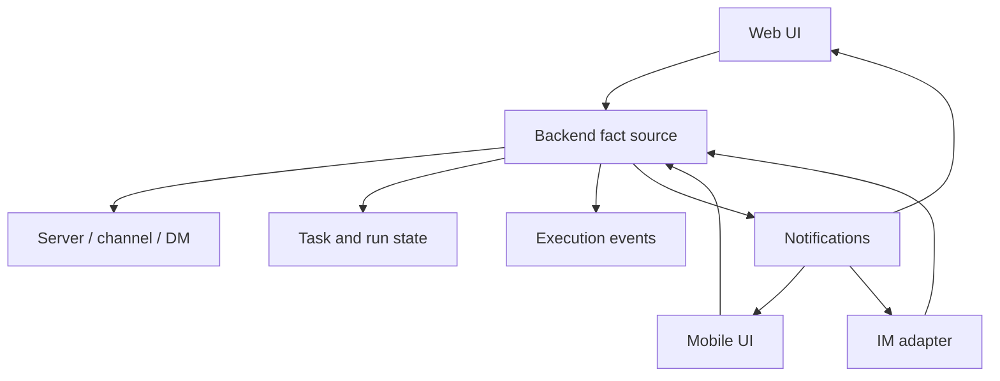

Poco expands the interaction model beyond a single desktop browser session.

## Shared fact source

Multi-end support doesn't mean duplicating separate UIs with separate state. Web, mobile, and IM entry points all converge on the same backend facts for servers, channels, messages, tasks, runs, execution events, and notifications.

## Areas

- [Mobile support](./mobile)
- [IM support](./im)
- [Self-hosted deployment](./self-hosted)
- [Cloud subscription](./cloud-subscription)
- [Multilingual support](./multilingual)
