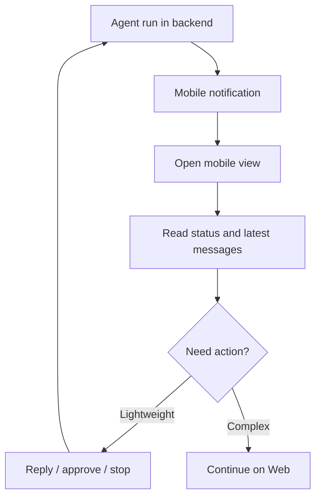

Poco supports mobile scenarios so you can manage agents away from your desk.

## Mobile follow-up flow

Mobile reads the same task and execution state from Backend. You can inspect channel updates, run state, and notifications, then decide whether a lightweight action is enough or whether to continue on desktop.

## Benefits

- Check execution progress anytime
- Trigger follow-up actions on the go
- Stay connected to long-running tasks from a phone
