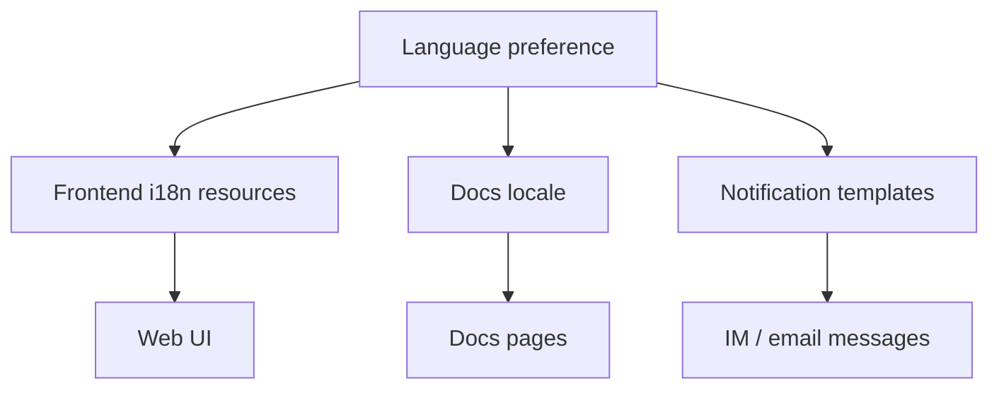

Poco aims to support multiple languages in both product experience and documentation.

## Localization flow

Product UI, documentation, and notifications all start from the same language preference. When a user switches language, the UI resources, docs locale, and notification templates follow that setting.

## Benefits

- Better onboarding for global users
- More natural communication in different teams
- Easier localization of product and docs
