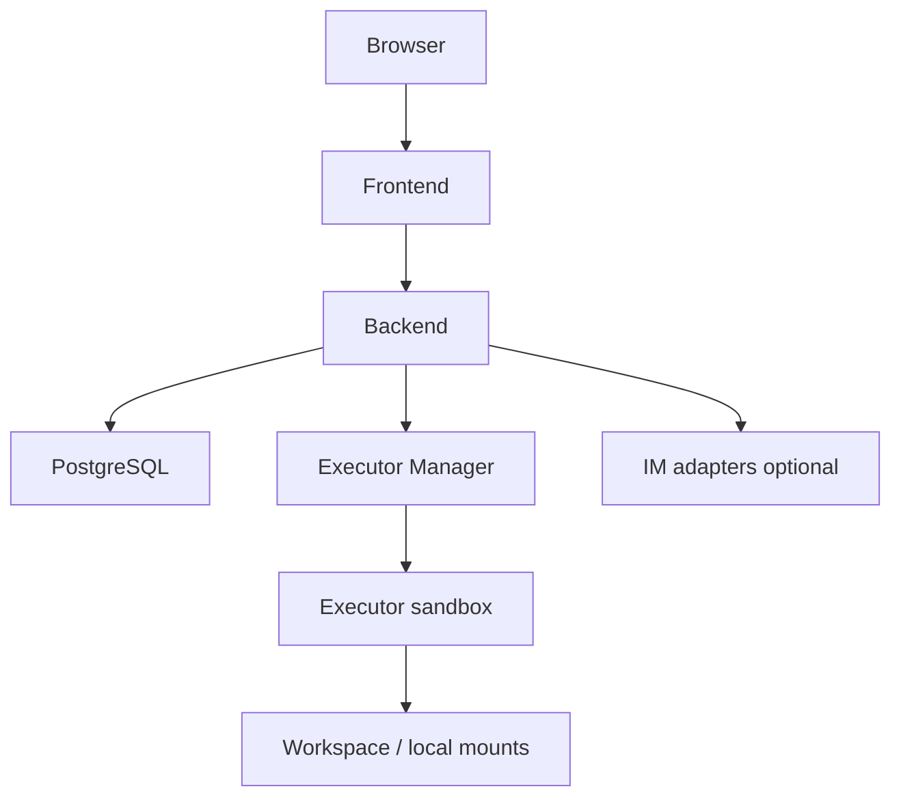

Poco can be started through Docker for personal or team-owned environments.

## Self-hosted service layout

A complete self-hosted deployment usually includes Frontend, Backend, Executor Manager, Executor, a database, and optional IM adapters. Backend remains the source of truth while the services communicate over the internal network.

## Why it matters

- One-click local startup experience
- Full control over runtime and data
- A complete environment for internal use or experimentation
