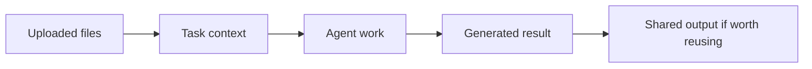

Poco supports file-based input so agents can work from screenshots, reports, documents, datasets, and other real materials. The point is not just to attach a file to a chat. It is to let the task start from the material itself instead of a hand-written summary.

## The role of uploaded files

Uploaded files belong to the task input layer. They usually support the current session, the current task, or the current project goal.

Poco keeps the roles clear: uploads help the agent understand the task, and the right outputs can later become shared collaboration material.

## Typical uses

- Upload reference files as task input
- Let the agent reason over instructions and document content together
- Process multiple file types in one workflow
- Generate follow-up work from screenshots, reports, or design documents

## Uploaded files, project files, and shared files

These three file types do different jobs in the product.

| Type            | Main purpose                                | Lifecycle                         |
| --------------- | ------------------------------------------- | --------------------------------- |
| Session uploads | Input materials for one task                | Current session or current task   |
| Project files   | Stable reusable project context             | Persistent across the project     |
| Shared files    | Public outputs worth reusing in the channel | Reused over time in collaboration |

That distinction matters. Not every upload should automatically become a public result, and not every public result should still be treated like a one-off attachment. A file can begin as task input and later move into the shared collaboration layer once it proves useful beyond the original run.
