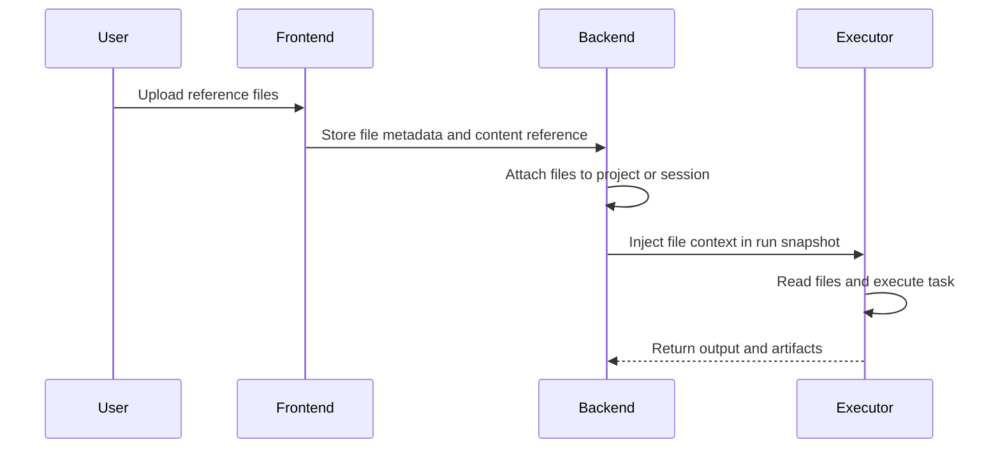

Poco supports file-based input so agents can work from more than plain text prompts.

## Upload flow

Uploaded files are registered as session or project context, then included in the run snapshot. The agent can read those materials during execution and produce new artifacts as output.

## Typical uses

- Upload reference files as task context
- Process multiple file types in one workflow
- Combine user instructions with file content for better execution quality
