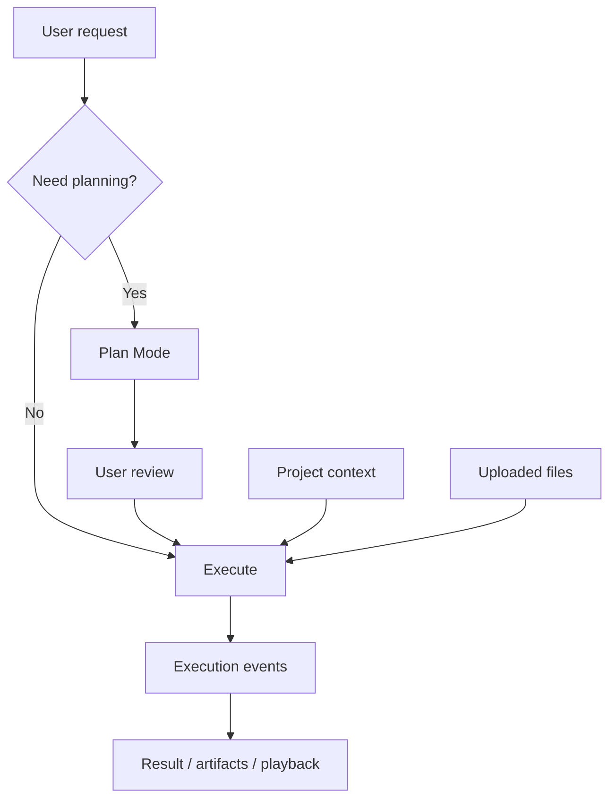

Poco is designed around execution workflows, not only conversation.

## From chat to executable work

A normal chat centers on one reply. Poco centers on executable work: a request can enter Plan Mode, bind project context and files, and run in the background while execution events and artifacts remain reviewable.

## Included capabilities

- [Plan Mode and conversation controls](./plan-mode)
- [Project management](./project-management)
- [File upload](./file-upload)
