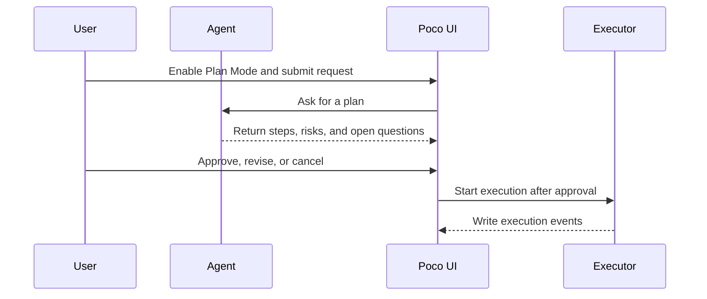
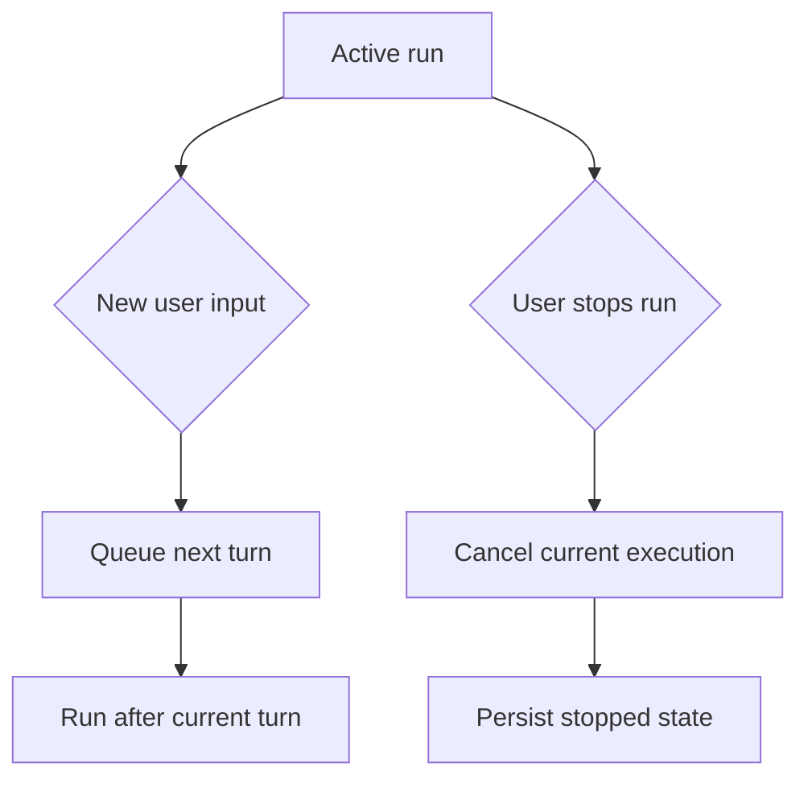

Poco supports workflow-oriented conversation control.

## Plan Mode flow

Plan Mode produces a plan before execution. This phase doesn't edit files by default, and it keeps planning separate from tool execution.

## Queueing and termination

During a long task, the user may send more input or stop the run. Poco needs to coordinate those inputs with the current execution state.

## Highlights

- **Plan Mode** for structured thinking before execution
- Conversation queueing to handle multiple pending interactions
- Conversation termination when a task should stop cleanly

These controls make long-running agent workflows easier to manage than a plain chat loop.
