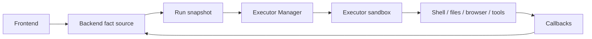

Every task runs inside an isolated containerized environment.

## Execution boundary

When a user request enters Backend, Poco turns it into a run and permission snapshot. Executor Manager claims the run, Executor performs the work in isolation, and callbacks write messages, tool events, status, and artifacts back to Backend.

## Why it matters

- Dependencies can be installed freely inside the task environment
- Files can be created, modified, and deleted without polluting the host system
- Commands run in isolation, which reduces operational risk for local and shared environments

## What this enables

- Safer experimentation for coding tasks
- Clean per-task environments
- Reproducible execution behavior across sessions
