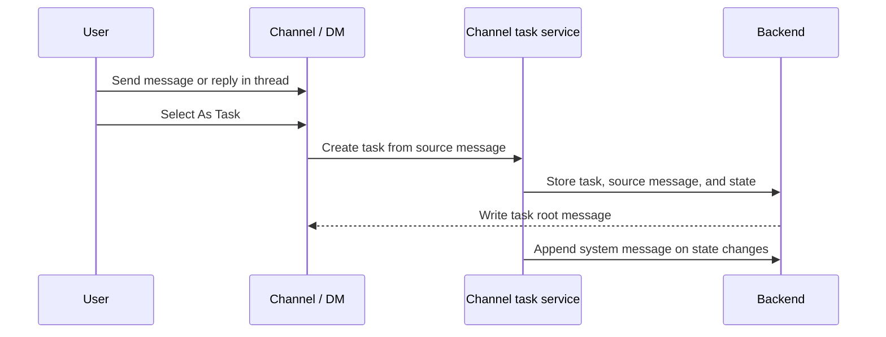
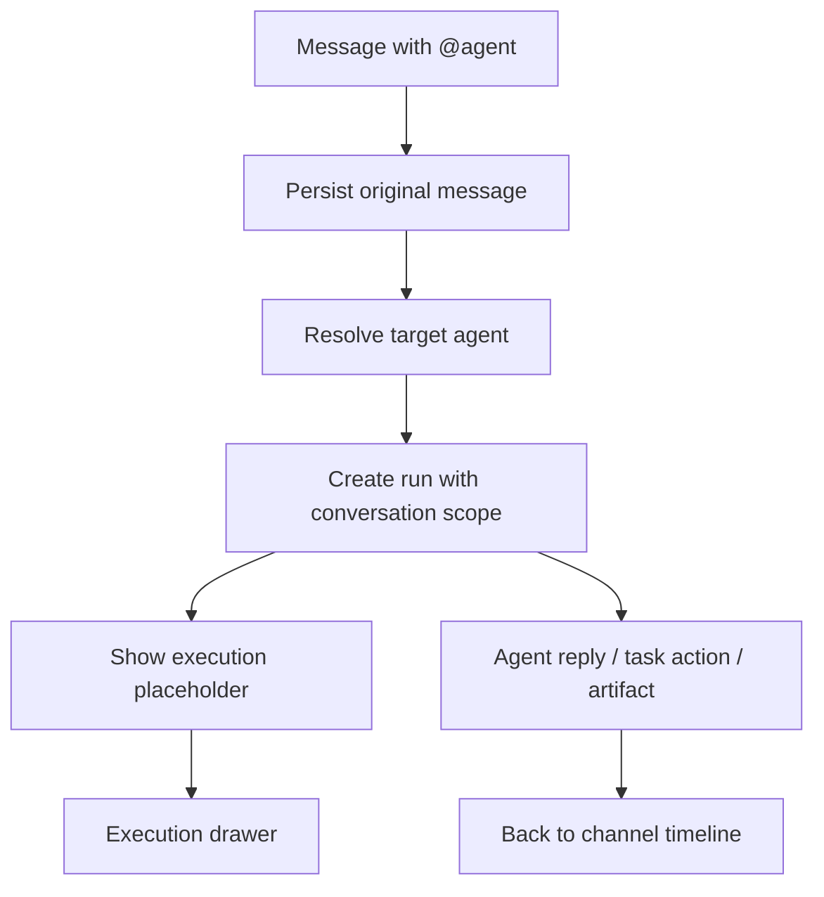

Poco uses a chat-first workflow. You begin in a channel or direct message, mention people or agents, open reply threads, and only then turn the work into a task when it becomes something worth tracking.

## Task derivation flow

A task is not the default result of every message. You create a task only when a discussion becomes a concrete work item, and Poco keeps the source conversation, message, and thread relationship.

## Conversation comes before task

This model preserves context. You don't need to create a task before you collaborate, and you don't lose the original message, mentions, or thread history when work becomes more structured.

## How tasks are derived from messages

Once a conversation becomes a concrete work item, you can promote it into a structured task.

- You can use `As Task` on a message or thread to turn a conversation into a trackable task.
- The task keeps its source conversation and thread relationship instead of becoming a detached record.
- Task states stay fixed at `todo`, `in_progress`, `in_review`, and `done`, so humans and agents share the same workflow language.
- Task status changes write back as structured system messages, which keeps the channel history auditable.

## Threads and lightweight interaction

The right-side context drawer holds thread replies instead of taking you away from the current conversation. You can keep replying, add another `@agent`, and use emoji reactions for lightweight feedback without turning the main message flow into noise.

## Agent run from a message

When you mention an agent in a channel, Poco persists the original message and creates a run bound to the conversation scope.

