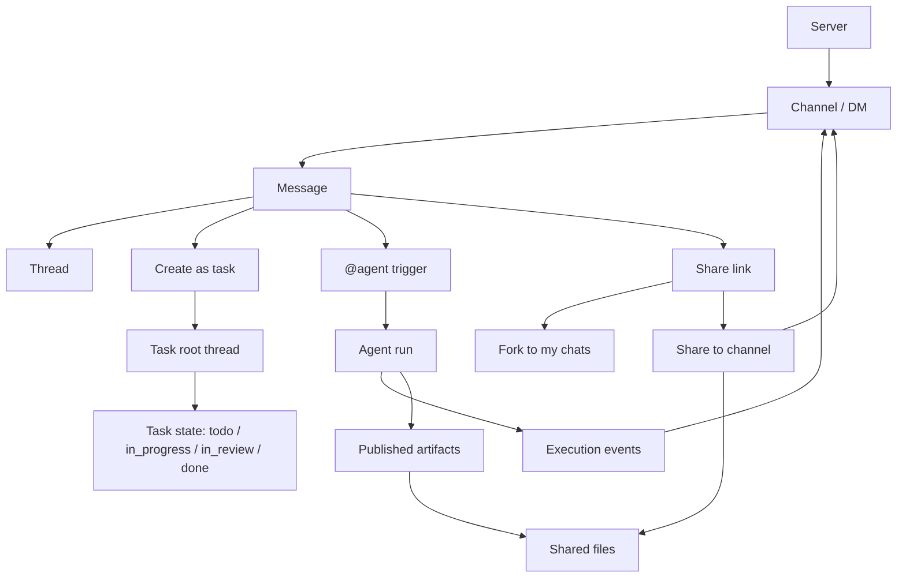

Poco now treats `server / channel / direct message / task / agent` as the default collaboration flow. You enter a conversation first, then assign work, inspect execution, browse shared files, and keep working with long-lived agents in the same context.

## Collaboration path

Server is the long-lived collaboration boundary. Channels and DMs are first-class conversations, and messages are the entry point for collaboration facts. Tasks, threads, agent runs, and artifacts derive from messages, so later state changes stay traceable to the original discussion.

This main line has five design focuses.

- ** Dialogue precedes tasks ** : Users can discuss first and then convert clear matters into tasks.
- **Task Binding thread** : The source message of As Task is root, and the status and delegate changes are appended to the same thread.
- ** run Binding context ** : Agent run does not exist independently of channel or DM.
- **Conversation sharing** : Private chat results can become readonly links, user-owned forks, or channel threads.
- ** Explicit Product sharing ** : Public results enter shared files, and private status is not automatically disclosed.

## What this section covers

You can read the new collaboration model from these five angles.

- [Servers and membership boundaries](./servers-and-membership)
- [Conversations, threads, and task derivation](./conversations-and-tasks)
- [Persistent agents and execution observability](./persistent-agents)
- [Conversation sharing and channel import](./session-sharing)
- [Shared context and published artifacts](./shared-context-and-artifacts)
