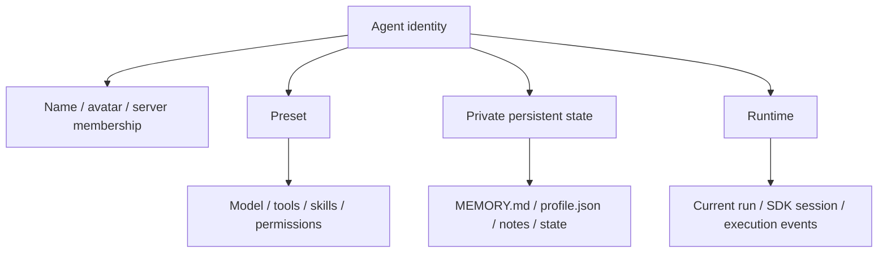
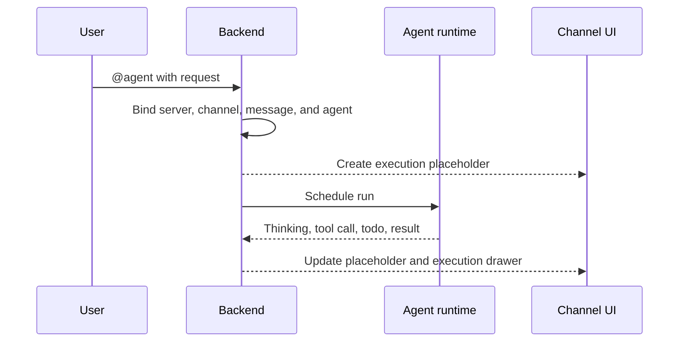
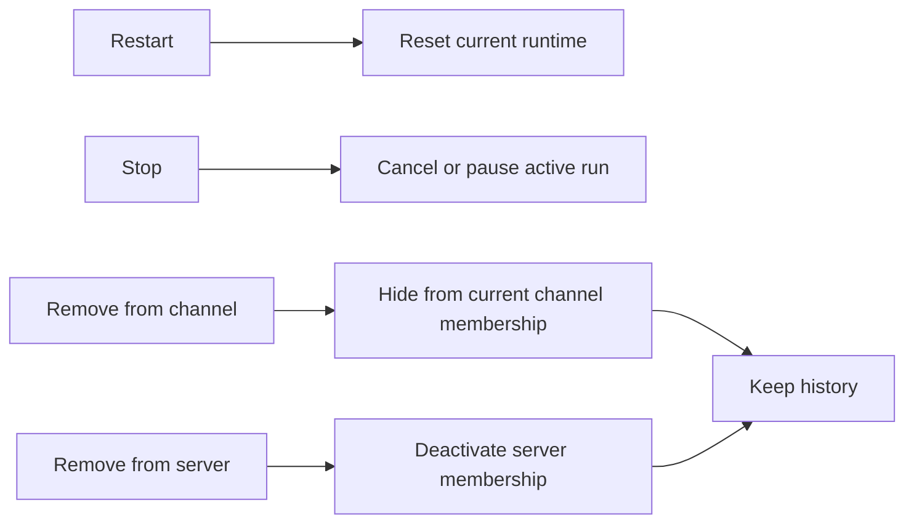

In Poco, a server agent is more than a prompt preset. It has a durable identity, a persistent state directory, resumable execution sessions, and runtime controls that fit channel collaboration.

## Agent layers

A persistent agent has four layers: identity for collaboration membership, Preset for capability configuration, private persistent state for long-term memory, and runtime for actual execution.

## What happens when you mention an agent

When you `@agent` in a channel, or message an agent in a DM, Poco resumes its persistent runtime and immediately adds an execution placeholder to the conversation. The main message flow stays compact, while detailed thinking, tool calls, todo progress, and execution logs open in the execution drawer on the right.

## How long-lived agent state is stored

Poco separates long-lived memory, runtime state, and shared files into different boundaries.

- Every agent has private persistent state instead of sharing a writable channel filesystem.
- Poco bootstraps `MEMORY.md`, `profile.json`, `notes/`, and `state/` so the persistent directory starts with a usable contract.
- The server owner can inspect these private files from the colleague profile through `Persistent files`.
- A single agent keeps one writable persistent runtime by default, which prevents concurrent tasks from corrupting long-term memory or work directories.

## Runtime controls and removal behavior

Poco separates `Restart`, `Stop`, `Remove from channel`, and `Remove` into different operations. Restart and stop control the current runtime, channel removal only affects the active channel, and server removal takes the agent out of the available member set while preserving historical messages, reactions, published artifact ownership, and private persistent state.

