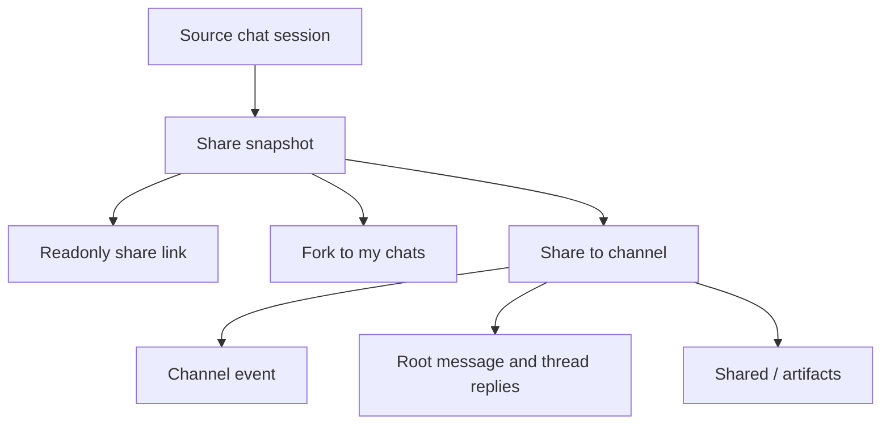
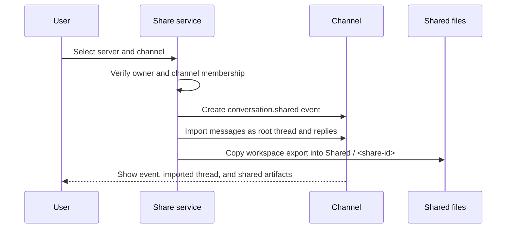

Poco treats sharing as a bridge between a private chat and a collaborative channel. A chat can first be shared as a readonly link, then either forked into another user's own chats or imported into a server channel as a thread with published artifacts.

## What sharing preserves

A share is not only a screenshot of the conversation. Poco captures the conversation messages, run summaries, timeline entries, replayable execution details, and workspace export references needed to review the work later.

This keeps the shared view reproducible enough for review while avoiding accidental continuation of the original session. Viewers see a readonly conversation surface, not a live composer.

## Share link

A share link is useful when the goal is to show the result or hand someone enough context to inspect the work.

- The link opens a readonly page for the shared chat.
- The chat area keeps the normal message reading experience, but interactive actions such as sending, regenerating, or branching are disabled.
- The execution panel can show replay steps, tool activity, file changes, and exported files when those records exist.
- Anonymous viewers can inspect the readonly page, but actions that create user-owned state require authentication.

The link behaves like bearer access to the shared snapshot. Anyone with the token can read the shared evidence, so users should treat it as a publish action rather than a private draft.

## Fork to my chats

An authenticated viewer can fork the shared conversation into their own regular chats when they want to continue from the shared context.

Forking creates a new chat record with copied messages, completed run summaries, and usage records. It also clears the SDK thread identity, so any later prompt starts a new execution thread instead of resuming the source session. This protects the original chat and the share link from later changes in the fork.

The fork starts from the shared snapshot's workspace export. If the user continues the fork with a new run, the fork receives its own new execution state and workspace export through normal callbacks.

## Share to channel

Sharing to a channel is for turning a private chat result into collaborative material.

The imported channel item has two parts.

- A `conversation.shared` event appears in the channel timeline so members can see that a chat was published.
- The first user message becomes the root message, and later messages become thread replies. This keeps the imported chat readable without flooding the main channel timeline.

When the shared chat has exported files, Poco publishes them under `Shared / <share-id>` in the channel artifact tree. This is a channel-side published copy, not a direct live view of the source session workspace.

## Timeline and review

Both the readonly share page and the imported channel thread should keep timeline-oriented review available. The goal is not to turn every tool call into a channel message. Instead, users can read the compact conversation first, then use the timeline, execution panel, and artifact tree to locate details when they need evidence.

## Boundary summary

| Path             | Best for                                    | What changes                                                         |
| ---------------- | ------------------------------------------- | -------------------------------------------------------------------- |
| Share link       | Showing a completed chat or review evidence | Creates a readonly token-backed view                                 |
| Fork to my chats | Continuing privately from shared context    | Creates a new user-owned chat                                        |
| Share to channel | Publishing work into team collaboration     | Creates a channel event, thread, and `Shared / <share-id>` artifacts |

The source chat remains the source of the snapshot, but later forks and channel discussions move forward independently.
