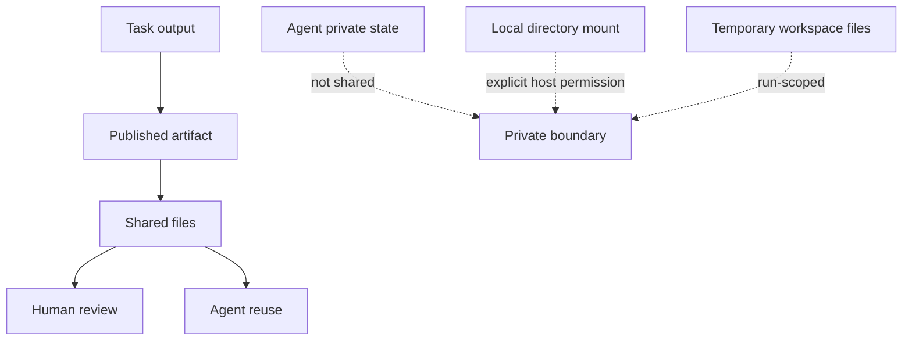
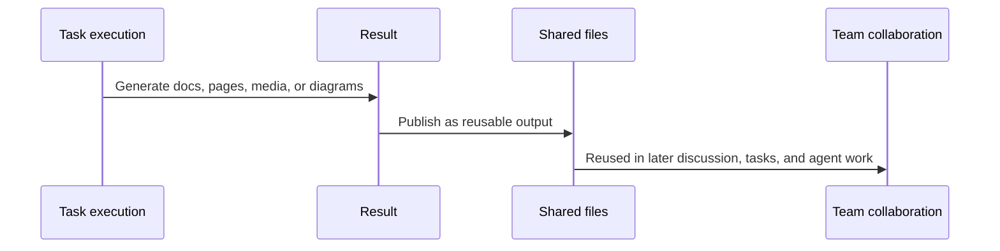

Poco does not treat a channel like a shared drive. It pulls out the results worth keeping and lets people and agents keep working from them. Private state, temporary files, and host directories stay separate.

## The sharing boundary

In Poco, public outputs, private state, local directories, and temporary workspaces are four different things.

What a channel shares is the result, not an agent's whole working directory. Private notes, long-term state, and host directories do not automatically appear in shared files. Users see a reusable public results tree instead of an exposed filesystem.

## How shared results are formed

Not every file created during a task becomes part of collaboration. Only outputs that are valuable for later discussion and reuse are promoted into the shared layer.

What stays behind is useful public material, not a pile of leftovers. It also means later agent work can pick up from an existing result instead of rebuilding the same thing again.

Shared artifacts do not only come from task execution. When you paste an image or pick a file in the channel composer, it is not published the moment you upload it — it is confirmed as a shared artifact only when you send the message, and joins the same artifact tree. Deleting its `#token` before sending cancels the publication (see [Conversations, threads, and task derivation](./conversations-and-tasks)).

## How shared files are used in collaboration

Shared files are collaboration materials first, processing inputs second. Poco supports both patterns, depending on what the work actually needs.

### Read the content directly

Best for:

- reading supporting documents
- reviewing a PDF resume or report
- summarizing, comparing, or giving recommendations
- extracting key information from existing material

In this mode, the expectation is simple: keep thinking from the content, not from the raw file.

### Continue from the original file

Best for:

- document conversion
- layout-sensitive editing
- asset extraction or page-level operations
- any task that depends on the original file format itself

In this mode, the point is to work from the file itself, not only from its text.

Keeping those two paths separate makes reading-heavy work lighter and file-heavy work less awkward.

## From references to ongoing collaboration

Referencing a shared file in a channel is more than a convenience feature. It keeps later work anchored to the same material.

Users can point an agent at the exact document that matters without pasting everything again. Even when several similar files exist in the same channel, later work stays tied to the one the user actually selected. Replies, task progress, and generated results all stay aligned to the same shared material.

For long-running work and multi-agent collaboration, that kind of stability matters more than squeezing more text into one prompt.

## Why Poco uses this design

Poco chooses a shared outputs tree instead of a shared writable directory because it fits real collaboration better.

| Model                     | What users run into                                                     | Poco's choice |
| ------------------------- | ----------------------------------------------------------------------- | ------------- |
| Share the whole directory | Temporary files, private content, and public results get mixed together | Not used      |
| Share only chat messages  | File-based results are hard to reuse reliably                           | Not used      |
| Share published outputs   | Public materials stay clear, reusable, and stable over time             | Used          |

From the user's point of view, the value is straightforward: clearer public boundaries, steadier follow-up work, and a better fit for both reading-focused and file-processing tasks.
