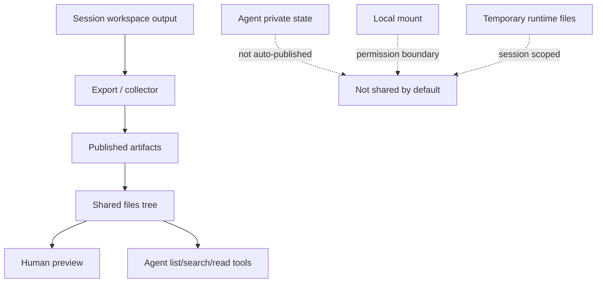
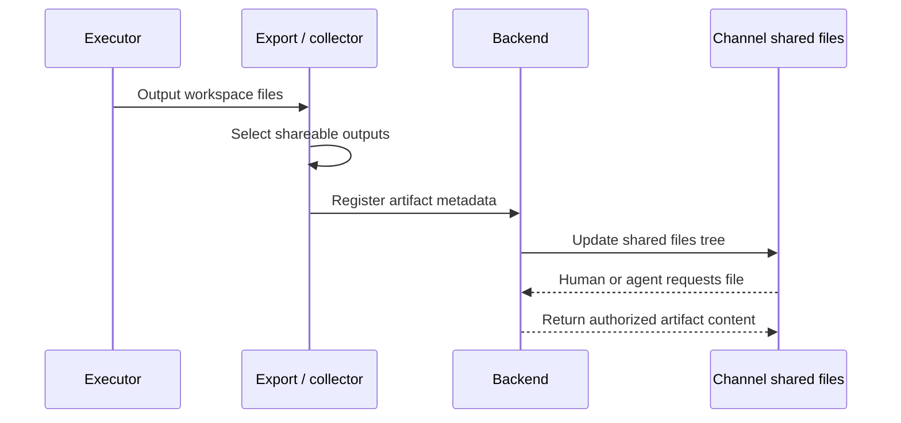

Poco does not turn a whole channel into one writable filesystem. Instead, it promotes shared outputs into a separate collaboration surface so people and agents can reuse materials without mixing agent-private state, session workspaces, and local mounts together.

## Sharing boundary

Public outputs, private state, local mounts, and temporary workspaces must stay separate. The Shared files drawer only shows published artifacts. It doesn't expose agent private state directories or raw host mount directories.

## What the Shared files drawer does

The `Shared files` drawer on the right shows published artifacts. Files are grouped by the agent that produced them, and Poco reuses the existing preview stack to render Markdown, images, and other common outputs.

## What enters the published artifacts tree

The first release only publishes outputs that are meant for collaboration reuse.

- Files that become collaboration-visible through session workspace export
- Files that are explicitly published
- Public materials that other people or agents in the same channel need to read next

`MEMORY.md`, `notes/`, `state/`, `/agent_state`, and raw local mount directories are not published automatically because they belong to private agent state or lower-level mount permissions.

## How agents read shared context

Persistent agents no longer depend only on one large prompt. Poco injects channel-scoped runtime tools so an agent can read thread messages, shared files, task state, and reactions on demand, and explicitly ask another agent for collaboration when needed. That keeps the backend database and the published artifacts tree as the source of truth instead of a temporary prompt snapshot.

## Channel runtime tool surface

The channel runtime tools are scoped to the current server, channel, session, and
agent identity. An agent does not pass those identity fields directly. Poco
resolves them from the current run before reading messages, files, tasks,
agents, or reactions.

- `read_channel_messages` reads channel messages. It can read exact
  `message_ids`, read a thread with `thread_root_message_id`, page before or
  after an `anchor_message_id`, return the recent top-level channel timeline
  when no selector is provided, or read every message with `read_all: true`.
- `list_channel_artifacts`, `search_channel_artifacts`, and
  `read_channel_artifact` discover and read published artifacts. They don't
  read `/workspace`, `/agent_state`, local mount paths, or unpublished session
  files.
- `list_channel_agents` returns active agents in the current channel.
- `request_agent_collaboration` explicitly asks another active channel agent
  to help. Text that mentions `@handle` in an agent reply is visible text only;
  it doesn't trigger another agent.
- `list_channel_tasks` and `read_channel_task` let an agent inspect
  team-visible channel tasks before it changes task state.
- `create_channel_task`, `claim_channel_task`,
  `update_channel_task_status`, and `comment_on_channel_task` operate on
  team-visible channel tasks. They don't replace the agent's private execution
  todos.
- `add_channel_message_reaction` and `remove_channel_message_reaction` let the
  current agent add or remove lightweight message feedback. Reactions don't
  trigger agent runs or change message content.

## Message reading strategy

Message reads use progressive disclosure. The agent starts from the trigger
message and only expands the context it needs.

- Use `message_ids` when the trigger envelope or another tool already points to
  specific messages.
- Use `thread_root_message_id` when the relevant context is inside a reply
  thread.
- Use `anchor_message_id` with `direction: "before"` or `direction: "after"`
  when the agent needs nearby channel history around a known message.
- Use no selector to inspect the recent top-level channel timeline.
- Use `read_all: true` only when the agent truly needs the full current channel
  message set. This mode can return thread replies as well as top-level
  messages.

Anchor-based paging currently follows the top-level channel timeline. It does
not merge thread replies into the same ordered timeline.
