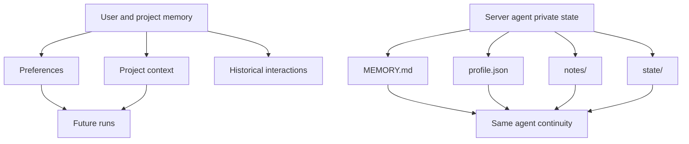
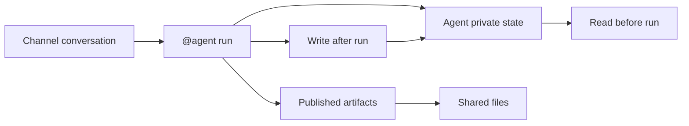

Poco has two memory layers. The first is a general memory layer powered by **mem0**, which preserves your preferences, project context, and interaction history. The second is the private persistent state owned by each server agent, which preserves long-lived collaboration memory and working state.

## Memory layers

General memory is scoped to users and projects. Agent private state is scoped to a long-lived server agent. Both improve continuity, but they have different lifecycles and visibility.

## What the general memory layer keeps

This layer focuses on information that stays useful across conversations and tasks.

- Personal preferences
- Project context
- Historical interactions

Over time, this helps the agent collaborate in a way that feels more adaptive and personalized.

## Private long-lived memory for server agents

Inside server collaboration, an agent also maintains `MEMORY.md`, `profile.json`, `notes/`, and `state/`. These files are not part of the channel's published artifacts tree. They belong to the agent's private persistent state and store stable constraints, role memory, and structured runtime state.

For the collaboration model around these files, see [Persistent agents and execution observability](./server-collaboration/persistent-agents).
