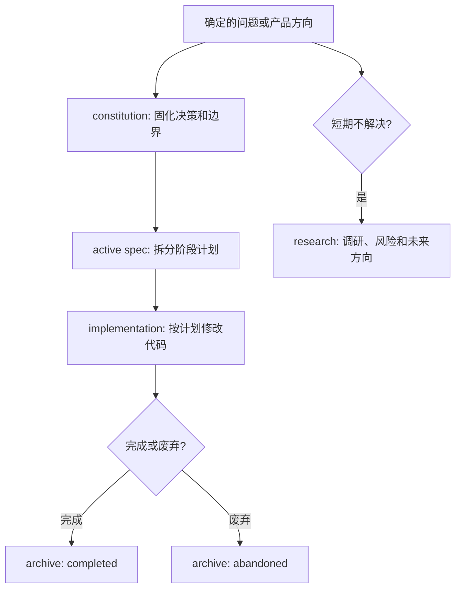

Poco 推崇 spec 驱动开发。它来自 harness 工程原则：尽可能把项目上下文留在仓库里，而不是散落在聊天记录、临时笔记或个人记忆中。

这意味着大功能修改不应只留下代码 diff。设计决策、尝试过的方案、实施计划、修改进度、未解决问题和未来研究方向，都应尽量进入 `specs/` 目录，方便后续开发者和 agent 审计完整链路。

## 为什么需要 spec 驱动

Agent 参与开发时，最大的风险不是“不会写代码”，而是上下文不稳定。一次对话里做出的判断，如果没有进入仓库，下一次会话、另一个 agent 或未来维护者都很难知道当时为什么这样做。

Spec 驱动开发把这些信息变成仓库资产。

- **可审计**：能追溯某个功能为什么这样设计、排除了哪些方案、当前执行到哪一步。
- **可恢复**：agent 可以从 `specs/active` 读取当前工作上下文，而不依赖上一轮聊天。
- **可协作**：产品、开发者和 agent 可以围绕同一份 constitution 或 spec 对齐边界。
- **可演进**：短期不落地的问题进入 research，避免被遗忘，也不会干扰当前执行。

## 文档链路

对于已经明确要解决的问题，推荐先形成 constitution，再从 constitution 拆出一个或多个 active spec，最后按 spec 执行并归档。

这条链路让“为什么做”“怎么做”“做到哪了”分开保存。Constitution 负责长期有效的决策，active spec 负责当前实施，research 负责尚未形成结论的探索。

## 各目录的职责

`specs/` 下的目录不是文件分类偏好，而是开发状态机。

| 目录            | 职责                                             | 什么时候使用                         |
| --------------- | ------------------------------------------------ | ------------------------------------ |
| `constitution/` | 记录已经确定的设计决策、体验目标和结构边界。     | 问题已经讨论清楚，需要固定长期约束。 |
| `active/`       | 记录正在实施的计划，包含背景、设计和分阶段任务。 | 已经决定要做，并且可以开始拆任务。   |
| `research/`     | 记录问题分析、方案评估、性能调查和架构演进设想。 | 短期无法解决，或还不需要立即落地。   |
| `archive/`      | 保存完成或废弃的 spec。                          | 实施结束，或方案不再继续。           |

大功能开发默认从 `active/` 读取当前上下文。新的 agent 接手时，应先看相关 constitution，再看 active spec，而不是从代码里重新猜设计意图。

## 什么时候写什么

如果一个问题已经明确、方向已经定下，应先写 constitution。它回答“我们决定了什么”，并固定后续实现不能轻易违背的不变量。

如果一个问题已经可以实施，应写 active spec。它回答“怎么做”，并把实施拆成可验证的阶段。

如果一个问题短期内无法解决，或者当前不需要尽快解决，应写 research。它回答“我们发现了什么、还需要研究什么”，避免把未来方向伪装成当前承诺。

## 大功能修改的建议流程

大功能修改可以按下面的节奏推进。

1. 先把问题写清楚：当前系统是什么状态，遇到了什么限制，不解决会怎样。
2. 如果方向已经确定，写入 `specs/constitution/`，固定设计决策和边界。
3. 根据 constitution 拆出一个或多个 `specs/active/*-plan.md`，写清阶段、验收点和影响范围。
4. 开始实现时持续更新 active spec，记录已完成、调整过的方案和新的风险。
5. 发现短期不落地的问题时，移动到 `specs/research/`，保留分析和后续研究方向。
6. 功能完成或方案废弃后，将 spec 移入 `specs/archive/`，保留历史。

这个流程不要求每个小改动都写完整文档。它主要面向跨模块、跨服务、会改变产品心智或架构边界的功能。

## 写作原则

Spec 文档应服务于后续实现，而不是制造形式感。

- Constitution 先写最终决策，再写必要背景和备选方案。
- Active spec 写清背景、设计和分阶段实施计划，不要只列任务清单。
- Research 写清问题、调研方法、发现、方案评估和后续建议。
- 文档要保留不变量、接口边界、数据流和失败处理。
- 过期内容不要静默删除，应通过历史变更、归档或 superseded 状态保留演进痕迹。

目标是让后来的人和 agent 能从仓库中恢复上下文：知道当时为什么这样设计、当前应该按什么计划推进，以及哪些问题仍然只是研究方向。
