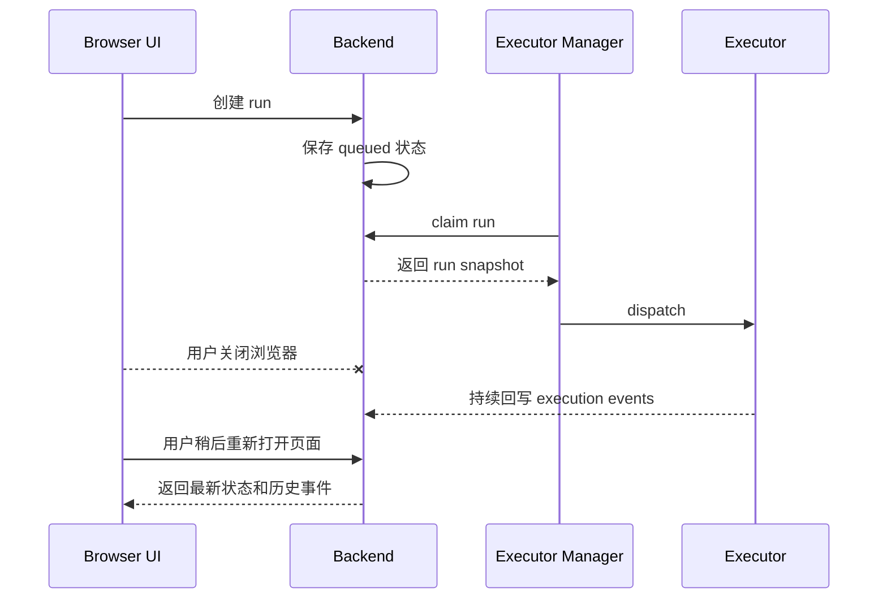
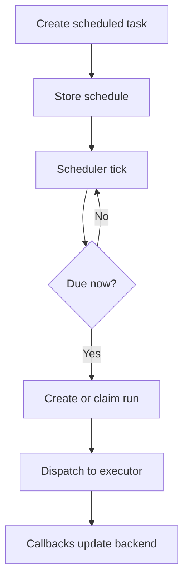

Poco 支持超出当前浏览器会话的长时间任务执行。这不只影响单个聊天会话，也支撑 server/channel 中的持久化 agent，以及 issue 场景下的长期 sandbox runtime。

现在 Backend 会持久化长期 runtime registry，Executor Manager 负责 idle controller，因此一个持久 runtime 可以在 `running -> warm_idle -> sleeping` 之间切换，同时保留它的长期状态。空闲策略触发时，Poco 默认会 `stop` 容器来释放计算资源，但不会删除 owner 绑定、workspace 和可恢复状态。

## 后台执行链路

当任务被创建后，Backend 保存 run，Executor Manager 负责领取和派发，Executor 在沙箱中执行。浏览器关闭只会影响当前 UI 连接，不会让已调度的 run 自动消失。

这条链路首先解决“人不盯着页面时，任务仍能继续推进”。它也让 IM 通知、移动端查看和定时任务成为可能。

## 定时与延迟执行

Executor Manager 可以把任务作为可调度对象处理。任务不一定马上进入 Executor，可以延迟到指定时间或由后台调度器按规则触发。

## 在 server 协作中的表现

当你在频道里 `@agent` 时，Poco 可以复用该 agent 的持久运行时，让执行持续在后台推进。频道消息流会先看到紧凑的 execution placeholder，更完整的 thinking、tool call 和运行细节则进入 execution drawer。

对产品语义来说，最大的变化是：`persistent` 不再等于“容器必须永远活着”。Poco 会保留 runtime owner、workspace、`/agent_state` 和会话锚点，只在有活跃工作或显式 Pin 租约时保持计算热启动。对 server agent 来说，这个 Pin 是 owner 控制的 `1-24 小时` keepalive 租约，而不是无限期常驻开关。

## 可靠性边界

后台执行依赖 Backend 作为事实源。Executor Manager 可以重试和派发，Executor 可以回写事件，但频道消息、task 状态、artifact 索引和历史记录都以 Backend 持久化结果为准。
