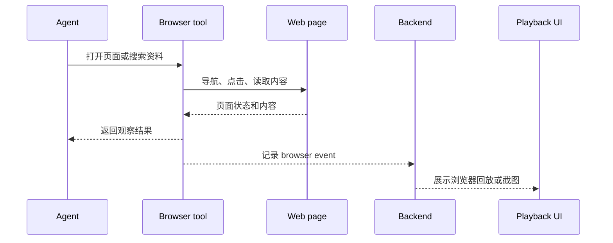

Poco 的内置浏览器让 Agent 可以在执行过程中访问网页、检索资料、阅读文档和检查运行结果。浏览器不是独立玩具，而是 Agent runtime 的一个受控能力。

## 浏览链路

当 Preset 或任务配置启用浏览能力后，Executor 会为 run 提供浏览器工具。Agent 的导航、点击、截图和页面读取会进入执行事件，方便用户回看。

## 典型用途

浏览器能力适合需要外部信息或可视化验证的任务。

- 阅读官方文档和 API 说明。
- 收集多站点参考信息。
- 打开本地预览页面检查 UI。
- 在提交结果前验证页面是否可访问。

## 与普通网页搜索的区别

普通搜索只给 Agent 一段文本。内置浏览器保留了页面交互过程，因此更适合调试 Web 应用、验证本地页面和处理需要登录态或多步导航的场景。

| 能力     | 文本搜索         | 内置浏览器                   |
| -------- | ---------------- | ---------------------------- |
| 页面交互 | 不支持。         | 支持导航、点击、读取和截图。 |
| 可回放性 | 通常只保留摘要。 | 可以记录关键浏览事件。       |
| 本地预览 | 难覆盖。         | 可以打开本地服务页面。       |
