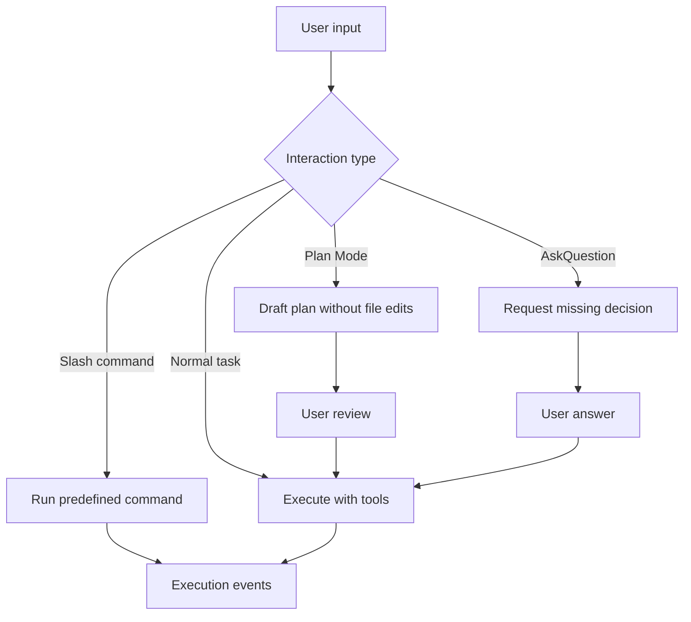

Poco 尽可能复刻大家熟悉的 Claude Code 原生交互模型，让已经习惯 Agent 编码工作流的用户可以快速上手，同时把执行过程接入 Poco 的后台调度、回放和产物系统。

## 交互模式

Claude Code 风格工作流的核心是“先明确意图，再执行工具”。Slash Commands 负责快速触发结构化动作，Plan Mode 负责执行前规划，AskQuestion 负责在信息不足时向用户澄清。

这种模式让 Agent 不必把所有不确定性藏在一次回答里。需要规划时先规划，需要用户决策时先提问，需要执行时再进入工具调用。

## 在 Poco 中的增强

Poco 把这些交互模式接入服务端状态，而不是只存在于浏览器会话中。

- Slash Commands 可以结合项目、Preset 和当前会话上下文。
- Plan Mode 的结果可以和后续执行记录关联。
- AskQuestion 可以在长任务中暂停并等待用户补充。
- 终止、排队和后台执行都能回写到同一条 session 或 channel 时间线。

## 与普通聊天的区别

普通聊天只强调回答质量，Claude Code 风格工作流强调可控执行。用户可以看到计划、批准执行、补充答案、终止任务，并在回放界面追踪工具调用。

| 能力     | 普通聊天           | Poco 工作流                    |
| -------- | ------------------ | ------------------------------ |
| 计划     | 作为一段回复出现。 | 可作为执行前阶段。             |
| 澄清     | 混在对话里。       | 可暂停运行并等待回答。         |
| 工具调用 | 不一定可见。       | 进入 execution events 和回放。 |
