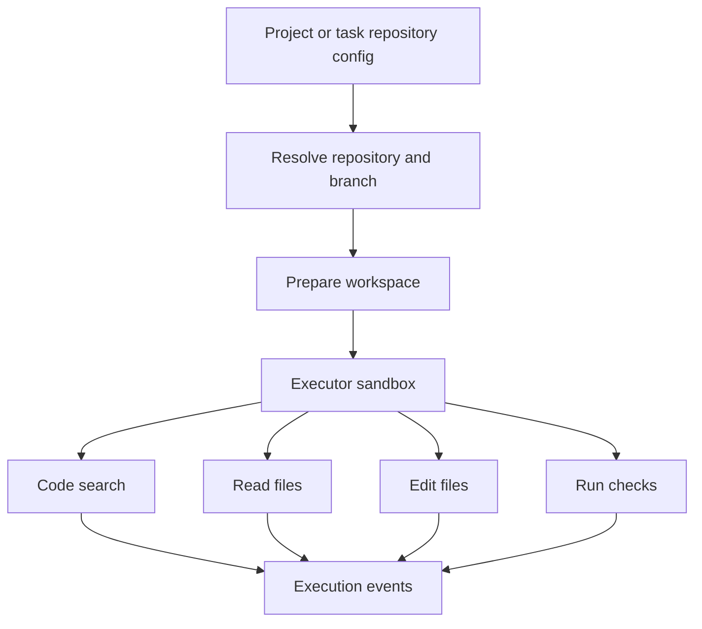

Poco 可以把 GitHub 仓库接入 Agent 执行工作流。连接仓库后，Agent 可以围绕真实代码上下文检索、阅读、修改和验证，而不是只根据用户粘贴的片段工作。

## 仓库进入运行时

仓库配置可以来自项目默认值、任务编辑器或 Preset 关联能力。运行时会把仓库上下文变成 Agent 可用的文件和工具能力，并把关键操作记录下来。

这种链路让仓库操作既有上下文，也有执行证据。用户可以在回放中看到 Agent 如何定位文件、执行命令和形成修改。

## 提供的价值

GitHub 仓库连接主要解决上下文不足和验证困难的问题。

- 面向仓库上下文的代码检索。
- 在产品内阅读真实项目文件。
- 围绕分支、目录和项目约束完成编辑。
- 结合沙箱执行测试、构建或静态检查。

## 与本地目录挂载的关系

GitHub 仓库连接和本地目录挂载都能提供代码上下文，但边界不同。GitHub 更适合远程仓库协作，本地目录挂载更适合自托管环境下直接操作宿主机文件。

| 方式            | 适合场景                       | 风险边界                     |
| --------------- | ------------------------------ | ---------------------------- |
| GitHub 仓库连接 | 远程仓库、分支协作、代码检索。 | 受仓库授权和运行配置约束。   |
| 本地目录挂载    | 直接修改本机项目目录。         | 受宿主机路径和读写权限约束。 |
