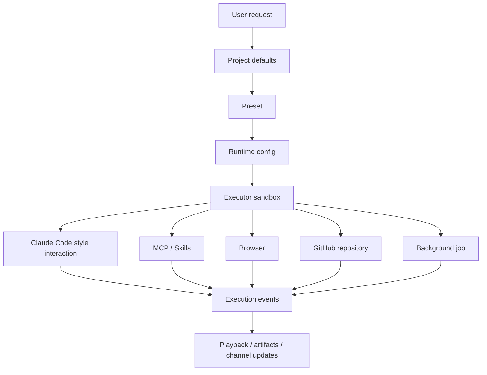

Poco 的 Agentic 体验不是在聊天框外面拼几个工具按钮，而是把规划、能力配置、工具调用、仓库上下文、浏览器和后台执行组织成一条可运行的 Agent 工作流。

## 工作流总览

一次 Agent run 会先继承项目和 Preset 配置，再进入沙箱执行。执行过程中，Agent 可以调用 MCP、Skills、浏览器和 GitHub 工具，过程事件会被回写到 execution drawer 和回放界面。

这个结构把“Agent 能做什么”和“这次 run 实际做了什么”分开。Preset 定义能力面，execution events 记录实际行为。

## 能力组成

下面这些页面分别解释 Agentic 工作流中的关键模块。

- [Claude Code 风格的原生体验](./claude-code)
- [Preset 运行配置](./preset)
- [MCP 与自定义 Skills](./mcp-skills)
- [内置浏览器](./browser)
- [GitHub 仓库连接](./github)
- [后台执行与定时任务](./background-jobs)

## 设计边界

Poco 把能力配置、执行环境和执行证据拆开，避免一个 prompt 同时承担所有职责。

| 层次             | 负责什么                                | 不负责什么                 |
| ---------------- | --------------------------------------- | -------------------------- |
| Preset           | 模型、工具、能力开关和子 Agent 组合。   | 不保存每次执行的过程事实。 |
| Executor sandbox | 运行模型、shell、浏览器和工具。         | 不直接成为业务状态事实源。 |
| Execution events | 记录 thinking、tool call、todo 和产物。 | 不决定长期权限和成员关系。 |
