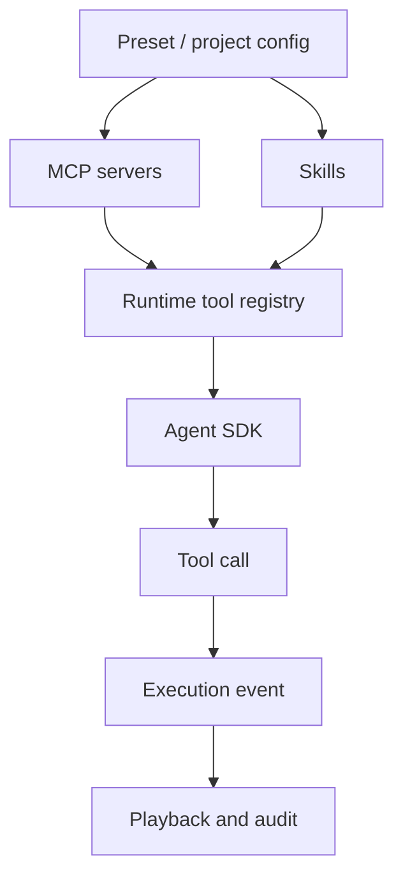

Poco 通过 MCP 和自定义 Skills 扩展 Agent 的能力面。MCP 更适合协议化工具接入，Skills 更适合沉淀可复用工作方法、领域知识和操作流程。

## 能力注入链路

MCP Server 和 Skills 通常从 Preset 或项目配置进入运行时。任务开始后，Executor 在沙箱里加载这些能力，并把调用过程记录为 execution events。

这条链路让能力扩展和行为审计同时成立。团队可以复用工具，也可以在回放中看到工具何时被调用、输入是什么、输出如何影响后续执行。

## MCP 和 Skills 的分工

MCP 和 Skills 都能扩展 Agent，但关注点不同。

| 类型   | 更适合做什么               | 示例                                   |
| ------ | -------------------------- | -------------------------------------- |
| MCP    | 接入外部系统和结构化 API。 | 数据库、搜索、内部平台、文件服务。     |
| Skills | 沉淀工作方法和领域流程。   | 代码审查流程、文档生成规范、调试步骤。 |

## 管理方式

Poco 会把能力配置收敛到 Preset、项目和管理页面，而不是让用户在每次对话里重新解释。这样做可以减少 prompt 噪音，也方便团队统一工具边界。

- 常用能力放入 Preset。
- 项目专属能力放入项目配置。
- 需要审计和复用的流程沉淀为 Skills。
- 需要访问外部系统的能力优先接入 MCP。
