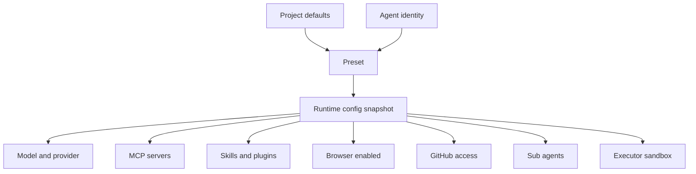
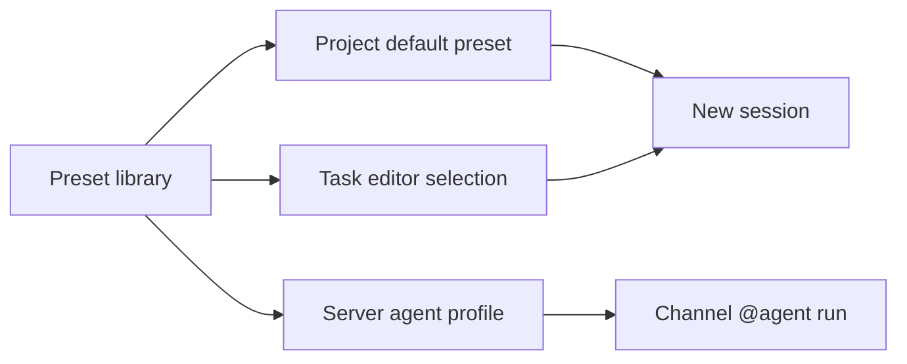

Preset 是一组可复用的 Agent 能力包。它把模型、工具、MCP Server、Skills、浏览器、子 Agent 和运行约束组合在一起，让不同场景可以复用稳定配置。

## Preset 在系统中的位置

Preset 不等于 agent identity，也不等于某次 run。Identity 代表长期协作身份，Preset 代表能力配置，run 代表一次具体执行。

当任务开始时，Poco 会把 Preset 展开成 runtime config snapshot。后续执行使用的是快照，因此执行过程可回放，也不会因为 Preset 后续被编辑而改变历史 run。

## 可配置项

Preset 的配置面向“这类 Agent 应该具备什么能力”。

- **模型**：指定默认使用的模型和供应商。
- **能力开关**：控制浏览器、记忆、本地挂载等能力是否启用。
- **工具**：配置 MCP Server、Skills 和 Plugins。
- **子 Agent**：指定当前 Agent 可以调用的协作对象。
- **图标与描述**：帮助团队识别 Preset 用途。

## 使用方式

Preset 可以在项目、会话和 server agent 中复用。项目可以绑定默认 Preset，新建会话时自动继承；单次会话仍可覆盖部分配置，兼顾标准化和灵活性。

## 取舍

| 方案                        | 问题                         | Poco 的选择 |
| --------------------------- | ---------------------------- | ----------- |
| 每次任务手动配置            | 重复劳动多，团队难保持一致。 | 不采用。    |
| 把配置写死到 agent identity | 难迁移，难复用，难做灰度。   | 不采用。    |
| Preset 作为能力包           | 可复用、可覆盖、可审计。     | 采用。      |
