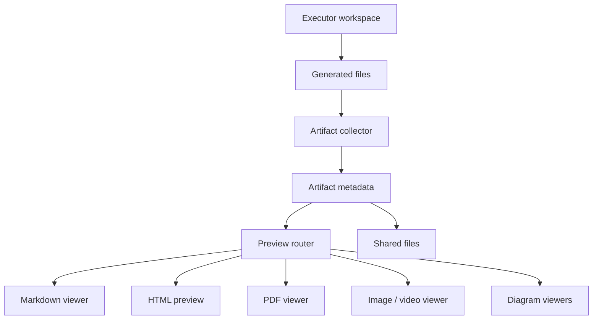

Poco 提供专门的产物展示界面，用于查看任务执行结果。产物不是聊天消息附件的简单堆叠，而是从执行工作区收集、登记、预览和共享的协作对象。

## 产物发布链路

Agent 在沙箱中生成文件后，系统会把可共享成果登记为 artifact。用户可以在产物界面预览，也可以在 server 协作中把它们作为 shared files 复用。

这条链路把“文件存在于工作区”和“文件成为协作成果”区分开。只有被登记的 artifact 才进入可预览、可共享和可追溯的产品界面。

## 支持的输出示例

产物界面覆盖常见的文档、网页、图像和图形文件。

- HTML
- PDF
- Markdown
- 图片与视频
- Xmind、Excalidraw、Drawio 等图形产物

## 为什么需要专门界面

Agent 的输出常常不是一段文本，而是一组可检查材料。专门的产物界面可以保留来源 run、文件路径、类型和预览方式，让用户直接消费生成结果，而不必频繁切换工具。

| 产物类型       | 预览重点                     |
| -------------- | ---------------------------- |
| Markdown / PDF | 阅读结构、排版和内容完整性。 |
| HTML           | 页面可视效果和交互状态。     |
| 图片 / 视频    | 媒体内容和生成质量。         |
| 图形文件       | 结构关系和可编辑性。         |
