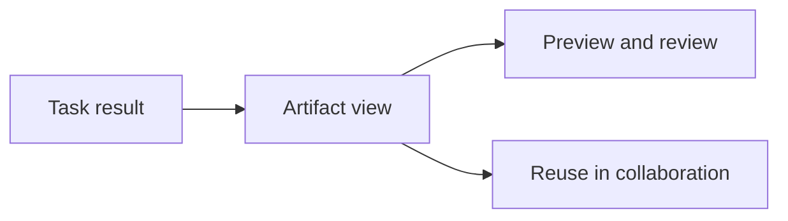

Poco 提供专门的产物界面来承接任务结果。它不是简单堆放附件，而是把当前生成结果与后续可能继续复用的材料组织到同一处界面中。

## 产物界面的作用

Agent 产出的文件，很多时候并不是“看过就结束”，而是还要继续复用、审查和推进工作。产物界面的价值就在这里。

用户在这里主要完成两件事：先判断结果本身是否可用，再决定它是否值得保留在后续协作中。

## 支持的内容类型

- HTML
- PDF
- Markdown
- 图片与视频
- Xmind、Excalidraw、Drawio 等图形产物

## 为什么需要专门界面

很多任务的最终结果并不是一句回复，而是一份文档、一段页面、一张图，或者一个图表。产物界面的意义，就是让用户能够在产品内直接查看和判断，而不必频繁切换到其他工具。

更重要的是，它给了执行结果继续留下来的机会。用户可以先检查质量、排版和可读性；如果这份结果还需要继续讨论、修改或复用，它就不再只是一次性的输出。

## 与共享文件的关系

只要一份结果仍然会在频道中继续被引用和复用，它就不再只是一次执行输出，也会进入共享文件体系。这样，后续的讨论、任务推进和新一轮生成，才能围绕同一份材料继续展开。
