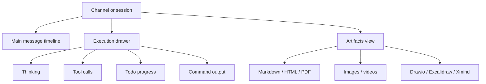

Poco 的界面目标不是把 Agent 输出堆到聊天窗口里，而是让用户能快速读结果、检查过程、预览产物，并在需要时切换主题和设备继续工作。

## 信息分层

Poco 把协作消息、执行过程和最终产物分开放置。主消息流保持可读，execution drawer 承载细节，artifact viewer 承载结果预览。

这个分层让用户不必在“太少信息”和“日志刷屏”之间二选一。日常协作看主消息流，需要审计或调试时再打开细节视图。

## 主要界面

下面几个页面解释 Poco 如何呈现执行结果和过程证据。

- [产物界面](./artifacts)
- [回放界面](./playback)
- [主题支持](./theme)

## 设计原则

界面能力围绕可观测执行展开。用户要能回答三个问题：Agent 现在做到哪一步、它刚才做过什么、最终产物能不能直接检查和使用。

| 问题             | 对应界面                           |
| ---------------- | ---------------------------------- |
| 当前任务进展如何 | 主消息流和 execution placeholder。 |
| 过程是否可信     | 回放界面和 execution drawer。      |
| 结果能不能消费   | Artifact viewer 和 shared files。  |
