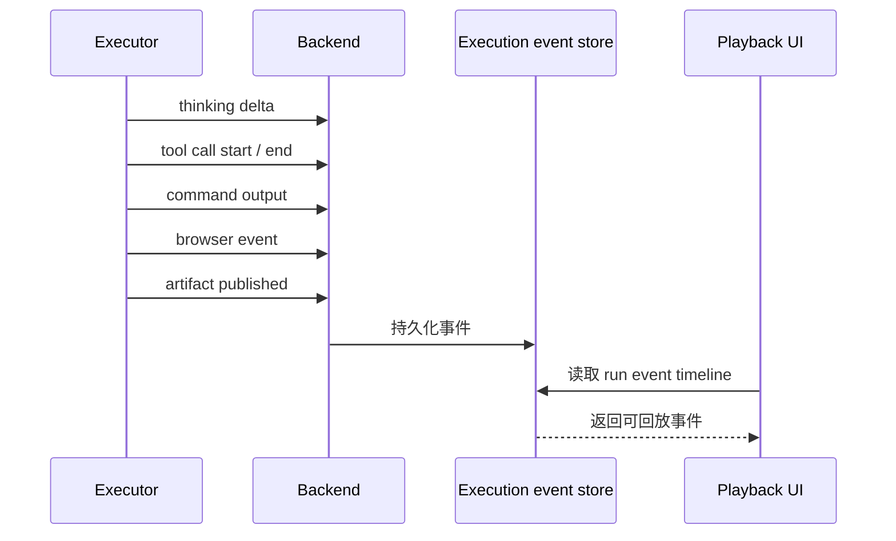
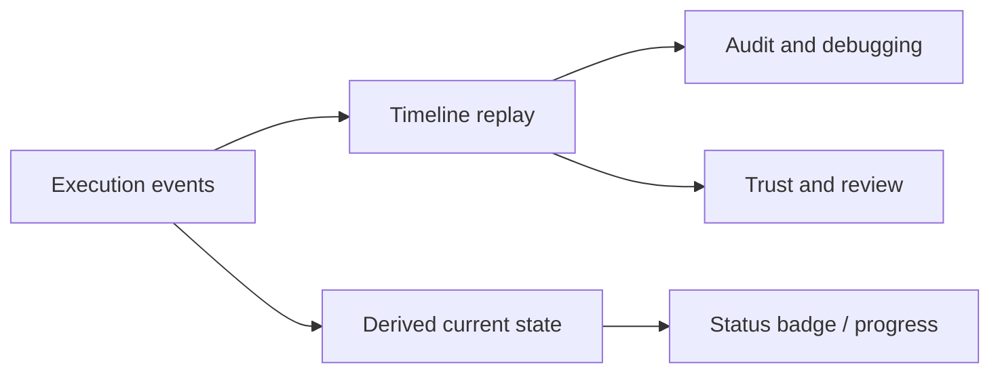

回放界面帮助你理解 Agent 在执行过程中究竟做了什么。它把执行事件从主消息流中拆出来，按时间线展示 thinking、tool call、命令输出、浏览器动作和产物生成。

## 事件流如何形成

Executor 在沙箱中执行任务时，会持续通过 callback 把过程事实回写到 Backend。Frontend 再把这些事件组织成可浏览的回放时间线。

回放记录的是“发生过什么”，而不是只展示“当前状态是什么”。这对调试、建立信任和审计行为都很重要。

## 可以查看的内容

回放界面聚合多类执行证据。

- 命令输入与输出。
- 浏览器操作轨迹。
- Skills 与 MCP 的调用记录。
- Todo 进度和状态变化。
- 产物发布和文件变更线索。

## 当前状态和历史事实

当前状态用于快速判断任务是否还在运行，历史事实用于解释任务为什么走到这个状态。Poco 把两者拆开，避免只看最终状态时丢失关键上下文。

