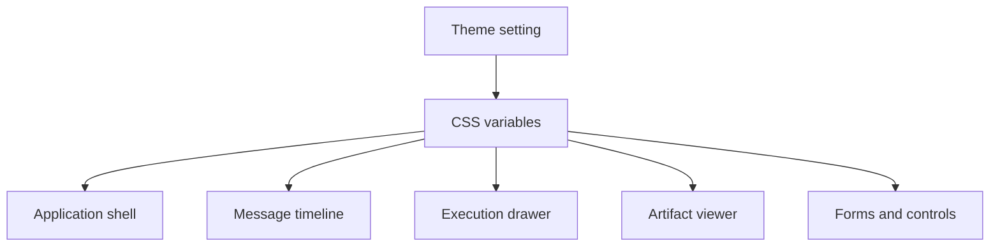

Poco 支持亮色与暗色两种主题模式。主题能力服务于长时间使用、跨设备查看和执行回放阅读，而不是单纯改变颜色。

## 主题应用范围

主题会影响 shell、聊天消息、执行抽屉、产物预览和表单控件。用户切换主题后，核心工作区保持同一套信息结构，只调整视觉变量。

使用 CSS variables 可以让主题切换覆盖全局界面，同时避免在组件里硬编码颜色。

## 为什么重要

主题支持会直接影响长任务观察和文档阅读体验。

- 在不同光线环境下有更好的可读性。
- 长时间使用更舒适。
- 桌面端与移动端都能获得更完整的产品体验。
- 执行日志、代码块和产物预览在不同主题下保持可辨识。

## 与界面系统的关系

主题不是某个页面的特殊样式，而是整个设计系统的一部分。组件应使用全局设计变量，保证新增功能自动适配亮色和暗色模式。
