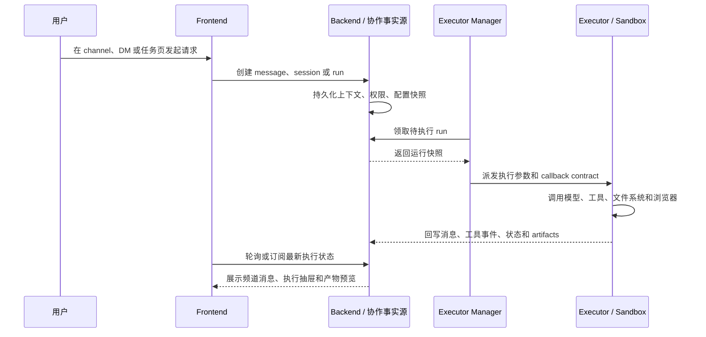
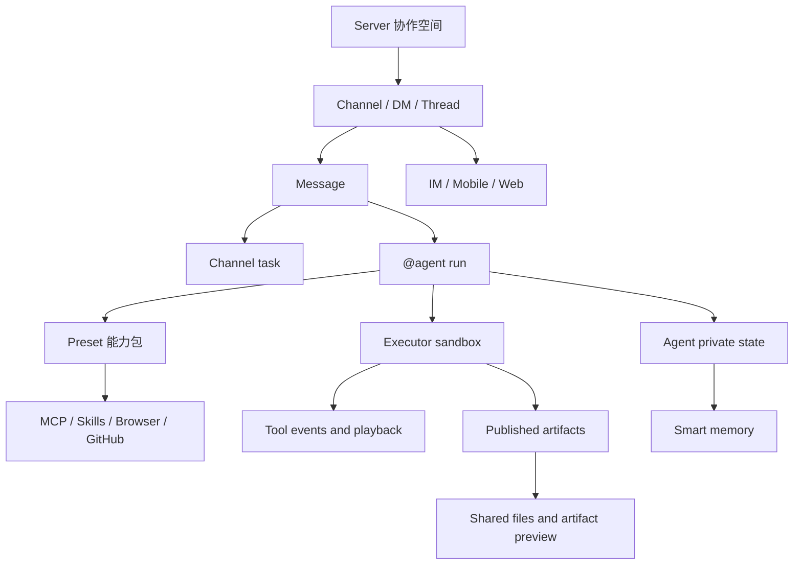
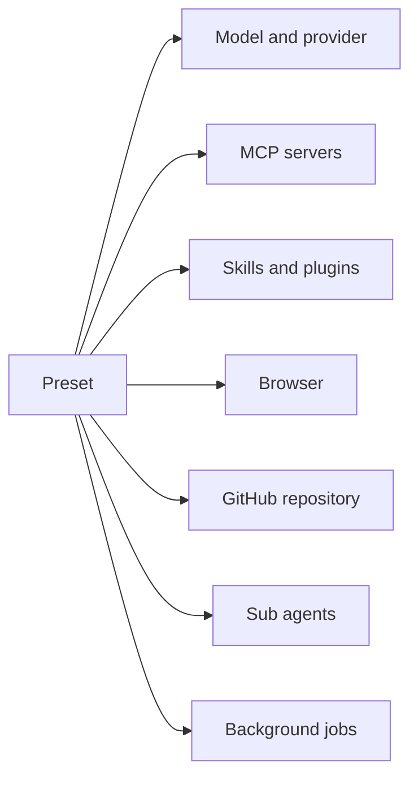

Poco 不只是一个聊天界面，而是把团队协作、安全执行、Agentic 工作流、丰富界面、多端交互和长期记忆整合到一起的开发者产品。

## 一次任务如何在 Poco 中流转

你可以先把 Poco 理解成一个“协作事实源 + 沙箱执行面”的系统。人类在 server、channel 或 DM 中发起需求，Backend 保存协作事实和运行状态，Executor Manager 负责调度，Executor 在隔离沙箱中运行 Agent，并把过程事件、工具调用和产物回写到 Backend。

这条链路把不同职责分开：Frontend 负责交互，Backend 负责事实与权限，Executor Manager 负责把可执行任务送进运行时，Executor 负责高权限工具执行。任务可以长时间运行，用户也可以在执行过程中继续查看进度、补充上下文或切到其他终端跟进。

## 核心能力分层

Poco 的功能不是彼此独立的页面集合，而是围绕同一条 Agent 工作流分层组合。上层是团队协作入口，中层是可复用的 Agent 能力和上下文治理，底层是安全执行、文件挂载、记忆和多端消息能力。

你可以从这张图读出三个关键边界。

- **协作边界**：server、channel、DM、thread 和 task 组织人类与 agent 的共同上下文。
- **执行边界**：Agent run 进入沙箱后才能调用 shell、浏览器、MCP、Skills 和仓库工具。
- **状态边界**：公开产物进入 shared files，agent 私有状态和长期记忆不会自动变成频道共享文件。

## 主要功能

### Server 协作与频道工作流

[Server 协作与频道工作流](./server-collaboration) 是 Poco 的协作主线。你可以在 server 中组织成员、频道和 DM，把普通消息转成 task，也可以通过 `@agent` 触发长期存在的 agent 执行工作。

这套模型采用 conversation-first 设计：对话先发生，task、thread、agent run 和 artifact 再从对话中派生。这样既保留了自然讨论，也让明确工作项可以进入可追踪状态。

### 安全沙箱与本地目录

[安全沙箱](./secure-sandbox) 让 Agent 在隔离容器里运行命令、安装依赖和修改文件，避免把执行风险直接放到主后端或宿主环境。[本地目录挂载](./local-directory-mount) 则用于自托管场景，让 Agent 在授权范围内读写宿主机上的真实项目目录。

这两个能力要一起理解：沙箱提供默认隔离边界，本地挂载提供显式授权入口。挂载目录不会自动变成频道公共成果，公开共享仍然通过 artifacts 协议完成。

### 不仅是 ChatBot

[不仅是 ChatBot](./not-just-chatbot) 覆盖 Plan Mode、项目管理和文件上传。Poco 的目标不是只生成一段回复，而是把一次需求推进成可规划、可执行、可中断、可回看的工作流。

项目级配置可以沉淀默认模型、Preset、仓库、本地挂载和参考文件。文件上传让任务输入不再局限于文本提示词，适合处理设计文档、报告、截图和其他上下文材料。

### Agentic 体验

[Agentic 体验](./agentic-experience) 关注真正的执行能力。Preset 负责把模型、工具、MCP、Skills、浏览器、GitHub 仓库和子 Agent 组合成可复用运行配置，后台执行与定时任务则让长任务不依赖浏览器页面一直打开。

### 精美而高效的界面

[精美而高效的界面](./beautiful-interface) 负责把执行过程变得可理解。主消息流展示协作结果，execution drawer 展示 thinking、tool call、todo 和命令历史，产物界面负责预览 Markdown、HTML、PDF、图片、视频和图形文件。

这让用户既能快速读结果，也能在需要时回放 Agent 做过什么。对于长任务、代码修改和多工具调用，执行可观测性是建立信任和排查问题的基础能力。

### 多端与消息驱动

[交互重构：多端与消息驱动](./multi-end-messaging) 把 Poco 从单一 Web 页面扩展到移动端、IM 和自部署通知场景。你可以通过钉钉或 Telegram 接收任务进展，也可以在离开电脑后继续跟进长时间任务。

这类能力建立在同一个后端事实源上：无论入口来自 Web、移动端还是 IM，最终都回到 server、channel、message、task 和 run 的统一状态模型。

### 智能记忆

[智能记忆](./smart-memory) 分成通用记忆和 agent 私有持久状态。通用记忆用于跨会话保留偏好、项目上下文和历史交互；server agent 的私有状态则用于维护角色设定、工作笔记和长期协作状态。

记忆不是频道共享文件。需要共享给同频道成员和其他 Agent 的内容，应发布为 artifacts；只服务于某个 agent 自身连续性的内容，则保留在 private persistent state 中。

## 功能地图

下面这些专题对应 Poco 当前最核心的能力面，你可以按协作主线或底层能力来阅读。

- [Server 协作与频道工作流](./server-collaboration)
- [安全沙箱](./secure-sandbox)
- [不仅是 ChatBot](./not-just-chatbot)
- [精美而高效的界面](./beautiful-interface)
- [Agentic 体验](./agentic-experience)
- [交互重构：多端与消息驱动](./multi-end-messaging)
- [智能记忆](./smart-memory)

## 建议阅读路径

如果你想快速理解 Poco 的产品形态，先读 [Server 协作与频道工作流](./server-collaboration)，再读 [Agentic 体验](./agentic-experience) 和 [精美而高效的界面](./beautiful-interface)。如果你更关心部署和执行安全，先读 [安全沙箱](./secure-sandbox)、[本地目录挂载](./local-directory-mount)，再进入 [本地部署](../deployment)。
