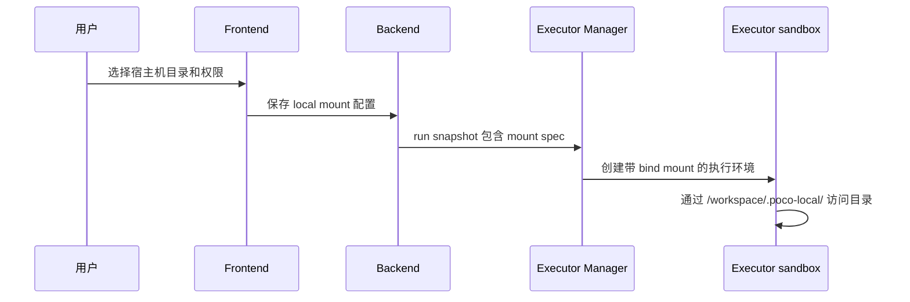
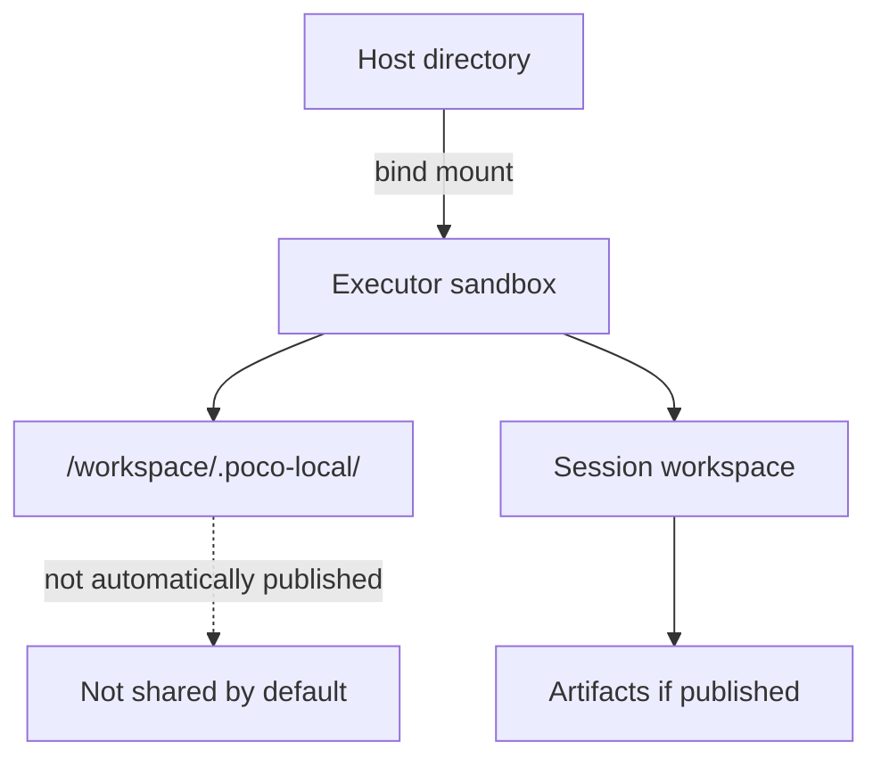

本地目录挂载让自托管用户把宿主机目录显式授权给 Executor 沙箱。Agent 可以通过容器内路径读取或写入真实文件，但挂载边界必须和沙箱、artifact、private state 区分清楚。

## 挂载链路

用户在任务编排器或聊天面板中选择本地目录，Backend 保存挂载配置，Executor Manager 在派发时把它转成容器 bind mount，Executor 在 `/workspace/.poco-local/` 下访问。

挂载目录在容器内以 `/workspace/.poco-local/<mount-id>/` 路径出现。`rw` 挂载中的更改会直接写入宿主机文件系统，`ro` 挂载只能读取。

## 使用方法

本地挂载适合自托管环境下直接操作真实项目目录。

1. 在任务编排器或聊天面板中打开**本地文件系统**对话框。
2. 将模式从**沙箱**切换为**本地挂载**。
3. 添加一个或多个目录条目，包含名称、路径和权限。
4. 提交任务，Agent 将在容器内通过 `/workspace/.poco-local/` 看到这些目录。

## 架构边界

本地挂载不是 shared files，也不是 agent private state。它是宿主机对当前 run 的显式授权入口。

## 可用性

本地目录挂载由 `DEPLOYMENT_MODE` 环境变量控制。

| 值      | 行为                           |
| ------- | ------------------------------ |
| `local` | 挂载功能启用，默认适合自托管。 |
| `cloud` | UI 中禁用挂载功能。            |

云端部署时不应默认开放宿主机路径能力。需要访问代码时，可以优先使用 GitHub 仓库连接或文件上传。

## 限制

本地挂载需要明确理解它的权限边界。

- 仅适用于自托管部署，需要直接访问宿主机文件系统。
- 云端部署时不可用。
- 只读挂载无法被 Agent 写入。
- 挂载内容不会自动进入 shared files 或 artifacts。
