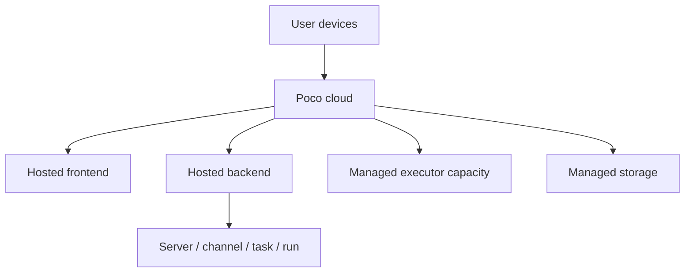

未来计划提供托管式的云端订阅形态，用更轻的方式提供 Poco 能力。云端形态会优先降低部署门槛，同时保留 server 协作、Agentic 工作流、产物预览和多端通知等核心体验。

## 云端形态的位置

云端订阅会把基础服务托管起来，用户通过 Web、移动端或 IM 接入。与自托管相比，云端更强调免运维和标准化运行环境。

云端形态需要更严格地区分托管能力和本地能力。例如宿主机目录挂载更适合自托管，云端则更适合远程仓库和上传文件。

## 方向

云端订阅的目标是让用户更快获得完整产品体验。

- 降低自部署门槛。
- 提供更轻的接入路径。
- 以托管方式提供 Poco 能力。
- 支持团队在标准化环境中协作。

## 能力边界

云端环境会优先支持跨端协作、远程仓库、上传文件和托管执行。涉及用户本机路径、内部网络和私有凭证的能力，需要通过明确授权或自托管部署解决。
