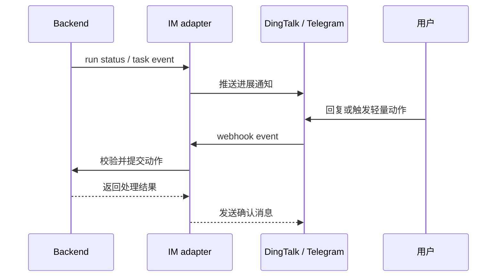

Poco 支持通过钉钉与 Telegram 进行消息驱动的交互。IM 通道适合通知、订阅和轻量触发，不替代 Web 端的完整配置与回放。

## IM 事件链路

IM adapter 从 Backend 订阅事件，并把关键状态推送到外部聊天工具。用户在 IM 中发起的轻量动作会经过 Backend 校验，再进入统一状态模型。

这条链路保证 IM 只是入口和出口，业务事实仍然落在 Backend。

## 可实现的能力

IM 支持适合异步工作和远程跟进。

- 推送任务进展通知。
- 通过聊天工具订阅事件。
- 不打开主 Web 界面也能进行轻量远程交互。
- 在 Agent 等待用户回答时及时提醒。

## 安全边界

IM 集成必须把外部消息转成受控动作。适合直接在 IM 中做的是确认、停止、简单回复和查看状态；涉及凭证、复杂配置、产物审查和批量操作时，应回到 Web。
